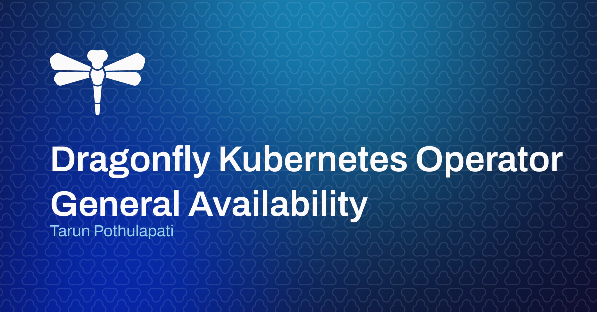

# 宣布 Dragonfly Kubernetes Operator 全面可用
我们很高兴地宣布 Dragonfly Kubernetes Operator 全面可用。

[Tarun Pothulapati](https://www.dragonflydb.io/blog/authors/tarun-pothulapati)  2023 年 11 月 6 日



## 介绍
我们很高兴地宣布，Dragonfly 的 Kubernetes Operator 现已全面推出，这使得在 Kubernetes 上运行和管理 Dragonfly 变得简单、轻松。Dragonfly 是专为现代云工作负载构建的数据存储，而 Kubernetes 是现代云工作负载的领先编排引擎，非常适合那些希望构建弹性、可靠和高性能应用程序的人。

除了全面上市之外，我们还很高兴地宣布推出新功能，例如高级快照、企业级安全性以及性能和可靠性增强。

要立即开始，请访问我们新更新的[Dragonfly Operator 文档](/docs/getting-start/README.md)。

---
## 高级快照
快照一直是 Dragonfly 可靠的数据备份机制。在这个最新版本中，我们将其提升到了一个新的水平，确保快照与 Kubernetes 和云存储解决方案更加无缝地集成。随着 Dragonfly 自定义资源定义 (CRD) 中高级 `snapshot` 字段的引入，配置和使用快照变得前所未有的简单。

通过设置此配置，您可以让 Dragonfly 在 Pod 终止期间自动处理数据备份，并在 Pod 再次恢复时自动处理数据备份，从而最大限度地减少停机时间并保持操作的完整性。

Dragonfly Kubernetes Operator 支持两种方式的快照：持久卷声明 (PVC) 和云存储。每个选项都具有独特的优势，可满足不同的用例和偏好。

### 1\. 持久卷声明（PVC）
`PersistentVolume (PV)`是 Kubernetes 用户用来从底层云或本地基础设施管理磁盘存储的方法。A`PersistentVolumeClaim (PVC)`是您的应用程序的存储请求。通过该`snapshot.persistentVolumeClaimSpec`字段，您可以使用完全相同的[Kubernetes PVC 语法](https://kubernetes.io/docs/concepts/storage/persistent-volumes/#persistentvolumeclaims)来配置 Dragonfly 快照存储。

```Plain Text
apiVersion: dragonflydb.io/v1alpha1
kind: Dragonfly
metadata:
  name: dragonfly-instance-snapshotting-to-pvc
spec:
  replicas: 1
  snapshot:
    cron: "*/5 * * * *"
    persistentVolumeClaimSpec: # uses standard Kubernetes PVC API
      accessModes:
      - ReadWriteOnce
      resources:
        requests:
          storage: 2Gi

```
[更多详细信息可以在Dragonfly Operator 快照到 PVC 文档中](/docs/managing-dragonfly/Dragonfly-Operator/Snapshots-through-PVC.md)找到。

### 2、云存储
Dragonfly 最近添加了对 S3 兼容云存储快照的支持。这允许直接从 S3 存储桶无缝写入和读取快照文件，并通过`--dr s3://<>`服务器参数实现。要利用此功能，必须使用必要的凭据正确配置环境。

`snapshot.dir`当相应地设置字段时，同样的操作也适用于由操作员管理的 Dragonfly 实例。此外，对于使用 Amazon EKS 等托管 Kubernetes 服务的用户，可以使用一些工具将 IAM 角色直接附加到 Kubernetes 服务账户。此功能简化了凭证管理，根据 Pod 的生命周期自动轮换，并且无需处理长期有效的凭证。

```Plain Text
apiVersion: dragonflydb.io/v1alpha1
kind: Dragonfly
metadata:
  name: dragonfly-instance-snapshotting-to-s3
spec:
  replicas: 1
  serviceAccountName: dragonfly-s3-svc-acc # service account with S3 permissions
  snapshot:
    dir: "s3://dragonfly-snapshots" # S3 bucket name

```
[更多详细信息可以在Dragonfly Operator 快照到 S3 文档中](/docs/managing-dragonfly/Dragonfly-Operator/Configure-Snapshots-to-S3-with-the-Dragonfly-Operator.md)找到。

---
## 企业级安全
### 1\. 客户端认证
通过在 Dragonfly Operator 配置中引入该`authentication`字段，我们简化了对连接到 Dragonfly 实例的客户端进行身份验证的过程。目前支持以下两种方式：`passwordFromSecret`和。`clientCaCertSecret`

`passwordFromSecret`利用 Kubernetes Secrets 来存储和管理凭证。通过在配置中指定机密，Dragonfly 将自动检索并使用与 关联的值作为`key`客户端的身份验证密码。

```Plain Text
apiVersion: dragonflydb.io/v1alpha1
kind: Dragonfly
metadata:
  name: dragonfly-instance-with-password-auth
spec:
    replicas: 1
    authentication:
      passwordFromSecret:
        name: dragonfly-auth
        key: password

```
`clientCaCertSecret`通过 Dragonfly 验证客户端证书，增强 TLS 的安全性。设置此功能还需要执行几个步骤。[上述两种方法的详细说明可以在Dragonfly Operator 身份验证文档](/docs/managing-dragonfly/Dragonfly-Operator/Dragonfly-Instance-Authentication.md)中找到。

### 2\. 服务器 TLS
Dragonfly Kubernetes Operator 现在支持 TLS 证书的集成。通过在 Dragonfly 实例配置中指定 Kubernetes Secret，您可以确保证书得到传播和配置。这会导致客户端和 Dragonfly 服务器之间的通信加密，从而保护网络通信免受中间人攻击。

[Dragonfly Operator 服务器 TLS 文档](/docs/managing-dragonfly/Dragonfly-Operator/Dragonfly-With-Server-TLS.md)中提供了将 TLS 与[cert-manager](https://cert-manager.io/docs/)结合使用。

---
## 监控和可靠性
### 1\. 使用 Prometheus 和 Grafana 进行监控
**Prometheus**是 Kubernetes 中监控和存储指标的默认方式。我们有关于如何安装 Prometheus Operator 并使用它来收集和存储指标的新[文档。](/docs/managing-dragonfly/Dragonfly-Operator/Integrate-Prometheus-with-the-Dragonfly-Operator.md)

然后可以使用**Grafana开始可视化这些重要指标。**我们提供包含重要指标的[自定义仪表板](/docs/managing-dragonfly/Dragonfly-Operator/Integrate-Grafana-with-Dragonfly-operator.md)，您可以直接加载并开始监控您的实例。

### 2\. 可靠性——定制推出策略
与依赖 Kubernetes 进行有状态集升级的传统方式不同，Dragonfly Operator 采用主动且受控的方法。当对 Dragonfly 自定义资源进行任何修改时，Operator 首先启动副本的升级过程。它会升级每个副本，并在继续之前暂停以确认至少一个副本是否已准备就绪。验证完成后，主服务器将升级，操作员选择最新的副本之一来承担主服务器角色。整个推出过程是自动完成的，无需额外的操作输入。

### 3\. 可靠性——使用`REPLTAKEOVER`命令进行升级
在之前的迭代中，升级 Dragonfly 带来了一定的挑战。特别是，从旧版本的主版本突然过渡到新版本可能会导致潜在的数据不一致。在此转换期间客户端未锁定，这意味着对旧主服务器的写入可能尚未完全传播到新主服务器，从而导致数据丢失。

该`REPLTAKEOVER`命令通过锁定旧主服务器来解决这些挑战，确保所有正在进行的操作都完成。只有达到这种稳定状态后，系统才会继续迁移到新的主服务器。

最后，由于最近更改为使用集群 IP 服务而不是无头服务，任何故障转移更新都会更快地传播到客户端。

---
## 基准测试
最后但并非最不重要的一点是，Dragonfly 以其超高性能和极其可靠而闻名。通过在容器化环境中运行 Kubernetes 中的所有抽象层以及 Dragonfly，我们能够在 AWS 实例上实现**130 万 QPS 和亚毫秒级 P99.9 延迟**`c6gn.8xlarge`。负载是使用[memtier-benchmark](https://github.com/RedisLabs/memtier_benchmark)工具生成的。详细的基准测试步骤和结果可以在下面的视频中找到。

---
## 结论
Kubernetes 旨在管理复杂的生产工作负载，而 Dragonfly 旨在以无与伦比的性能轻松扩展这些相同的工作负载。我们很高兴看到您所构建的内容。如果您想免费试用完全托管的 Dragonfly Cloud 帐户，[请在此处申请](https://www.dragonflydb.io/cloud)。

**此外，我们将于2023 年 11 月 15 日**举办有关 Dragonfly Operator 的在线技术研讨会。这是一个很好的联系和学习的机会，如果您有兴趣，[请在这里注册](https://www.dragonflydb.io/workshop-2023-11-15)。

