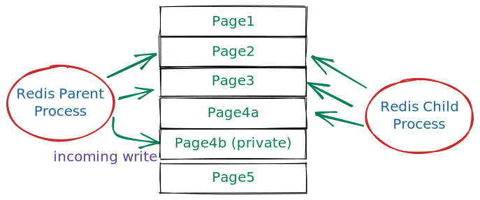
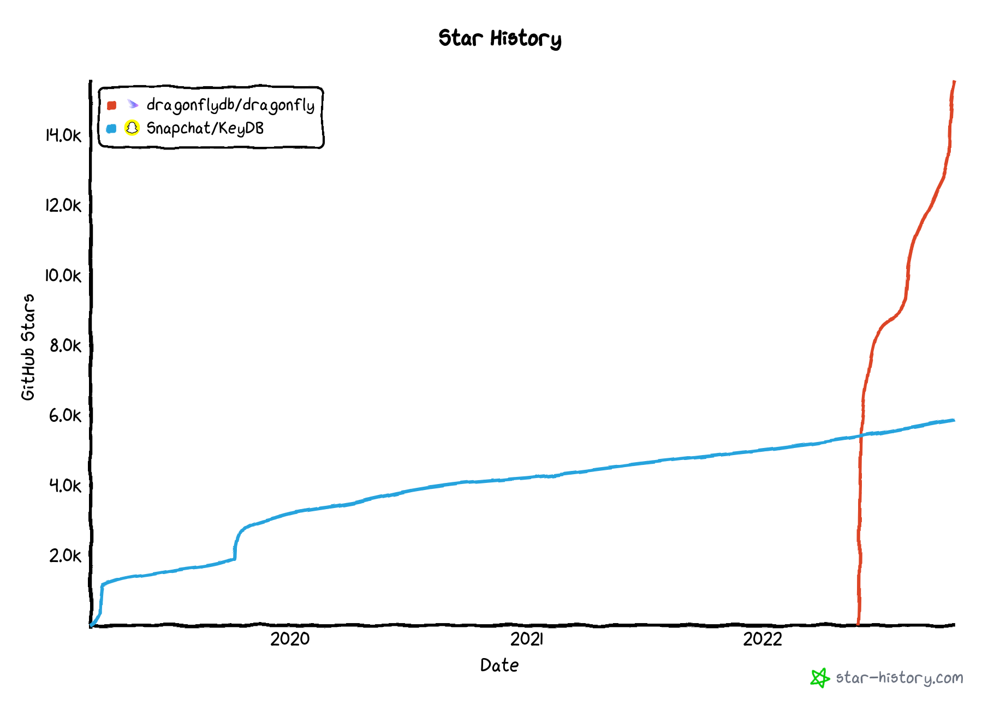

# 平衡与不平衡
平衡在生活中至关重要。当我们的注意力仅限于改善生活的某个方面时，我们就会削弱整个系统。

[罗曼·格什曼](https://www.dragonflydb.io/blog/authors/roman-gershman)  2022 年 10 月 30 日


平衡在生活中至关重要。当我们的注意力仅限于改善生活的某个方面时，我们就会削弱整个系统。如果你不为你的系统提供稳定性，它最终会在自身重量的作用下崩溃并破裂（或者，在杰瑞的情况下 - 漂浮）。

以 Redis 为例。它支持相对较高的吞吐量，但其持久化机制并不是为支持高负载而设计的：Redis 的写入吞吐量越高，系统就越脆弱。要理解原因，我需要解释 Redis BGSAVE 快照的工作原理。

BGSAVE 算法允许 Redis 将其内存数据的时间点快照生成到磁盘，或作为后台进程与其辅助副本同步。Redis 通过调用 Linux“fork()”来打开一个可以访问父进程内存的子进程来实现这一点。从这一点开始，两个进程具有相同的内容，并且它们的物理内存使用量保持相同，但是一旦其中一个进程写入内存，它就会创建该页面的私有副本。



此功能称为“写入时复制”，它是 Linux 内存管理系统的一部分。当某个进程复制内存页时，Linux 必须额外分配 4Kb 物理内存。

Redis 子进程不会更改其内存页面内容，它仅扫描条目并将其写入 RDB 快照。同时，Redis 父进程继续处理传入的写入。每次写入触及现有内存页时，它都会有效地分配更多物理内存。假设我们的Redis实例使用40GB物理内存。在 fork() 之后，父进程可能会复制每个页面，需要额外的 40GB RAM：总共 80GB。

但如果 R​​edis 的写入吞吐量足够低，它可能会在复制所有页面之前完成快照过程。在这种情况下，它最终可能会达到 40GB 到 80GB 之间的峰值。BGSAVE 期间的这种不确定行为给管理 Redis 部署的团队带来了巨大的麻烦：他们需要通过内存过度配置来降低 OOM 风险。

KeyDB 是 Redis 的一个分支，它的发布承诺使 Redis 更快，由于其多线程架构，可以维持更高的吞吐量。但是当 KeyDB 中触发 BGSAVE 时会发生什么？KeyDB 父进程可以处理更多的写入流量，因此它会在 BGSAVE 完成之前更改与子进程共享的更多内存页面。结果，物理内存使用量增加，使整个系统面临更大的风险。

这是KeyDB的错吗？不会，因为 KeyDB 并不需要更多内存，而且它的 BGSAVE 算法与 Redis 相同。但不幸的是，通过解决 Redis 不平衡架构中的一个问题，它引入了其他问题。

这种狭隘的方法并不是 KeyDB 所独有的。AWS ElastiCache 引入了类似的闭源功能，可提高多 CPU 计算机上的 Redis 实例的[吞吐量。](https://aws.amazon.com/blogs/database/boosting-application-performance-and-reducing-costs-with-amazon-elasticache-for-redis/)根据我的测试，它也遇到了同样的问题：在高吞吐量场景下，它要么无法生成快照，要么将吞吐量降低到低于 15K qps 的荒谬速率。

## 蜻蜓快照
让我们退后一步，将问题形式化。执行快照时的主要挑战是在并行更改记录时，保留快照隔离属性：如果快照于`t`时间开始并于 `t+u`结束，则它应反映所有entry在 时间`t`时的状态。

因此，我们需要一种方案来处理 传入必须更新但尚未序列化的记录。这给我们带来了一个问题：我们如何识别快照例程中的哪些条目已经被序列化，哪些还没有？

Dragonfly为此使用 ***版本控制***。它维护一个单调递增的计数器，该计数器随着每次更新而增加。存储中的每个字典entry都会捕获其“最后更新”版本，然后使用该版本来确定是否应序列化该条目。当快照开始时，它会将下一个版本分配给自己，从而为存储中的所有条目保留以下变体：`entry.version < snapshot.version`。

然后它启动主要遍历循环，迭代字典并开始将其序列化到磁盘。这是异步完成的，如下面的`fiber_yield()`调用概念所示。

```Plain Text
snapshot.version = next_version++;

for (entry : table) {
   if (entry.version < snapshot.version) {
     entry.version = snapshot.version;
     SendToSerializationSink(entry);
     fiber_yield();
   }
}
```
该循环不是原子的，并且 Dragonfly 可以并行接收传入的写入。每个写入请求都可以修改、删除或添加条目到字典中。通过在遍历循环中检查条目版本，我们确保没有条目被序列化两次，或者快照开始后修改过的条目没有被序列化。

上面的循环只是解决方案的一部分。我们还需要处理并行发生的更新：

```Plain Text
void OnPreUpdate(entry) {
  uint64_t old_version = entry.version;

  // Update the version to the newest one.
  entry.version = next_version++;  // Regular version update

  if (snapshot.active && old_version < snapshot.version) {
    SendToSerializationSink(entry);
  }
}
```
我们确保尚未序列化的条目（小于`version`）`snapshot.version`将在更新之前被序列化。

主遍历循环和`OnPreUpdate`钩子都足以确保我们将每个现有条目恰好序列化一次，并且在快照启动后添加的条目根本不会被序列化。Dragonfly 不依赖操作系统通用内存管理。

通过避免不平衡的`fork()`调用以及在更新期间将条目推送到序列化接收器，Dragonfly 建立了一种自然的背压机制，这是每个可靠系统都必须具备的。由于所有这些因素，无论数据集大小有多大，Dragonfly 的内存开销在快照期间都是恒定的。

真的有这么简单吗？不完全的。虽然如上所述的高级算法是准确的，但我没有展示我们如何跨多个线程协调快照，或者我们如何维护每个条目的`uint64_t`“版本”而不在每个Key上浪费 8 个字节等。

虽然快照问题乍一看似乎不是很重要，但它实际上是使 Dragonfly 成为可靠、高性能和可扩展系统的平衡基础的基石。像快照这样的功能是 Dragonfly 与其他构建高性能内存存储的尝试的区别之一，我认为开发人员社区认识到了这一点。



