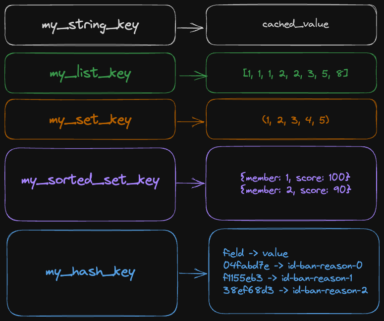
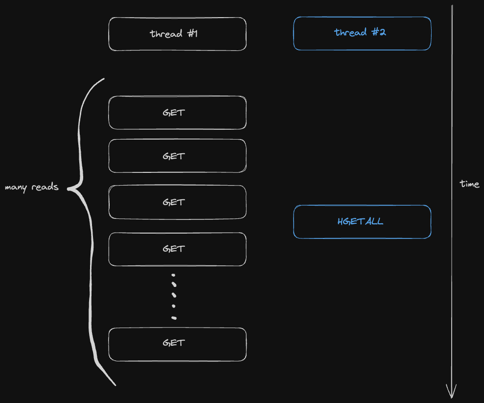

# 使用 Dragonfly 无所畏惧地处理 BigKey
当使用 Dragonfly（突破性的内存数据存储）时，与 BigKeys 较量几乎不是问题。如果您的服务器应用程序需要 BigKey，您可以无所畏惧地在 Dragonfly 中使用 BigKey。


## 介绍
Dragonfly 声称自己是地球上性能最高的内存数据存储，在 AWS EC2`c6gn.16xlarge`实例上拥有令人印象深刻的 400 万次操作/秒，并充分利用 CPU 和内存资源。鉴于计算机内存是一种宝贵的商品，Dragonfly 的使命是巧妙、高效地利用它。然而，就像任何传统的成功技术一样，在围绕它们构建应用程序时需要考虑一些限制。

使用内存数据存储时经常被忽视的一个陷阱是 BigKey 问题。理想情况下，内存数据存储实例应该具有高可用性，能够在亚毫秒内响应读写请求。但是，不必要的 BigKey 可能会导致速度变慢，甚至使内存中的数据存储无响应。原因很明确：尽管现代内存硬件和操作系统的速度极快，但现实世界的应用程序仍然经常需要 O(M) 时间复杂度的操作。当您需要执行 M 次超快操作时，所需的延迟可能会增加，导致最初看起来很快的操作实际上被认为很慢，具体取决于 M 的大小。

在这篇博文中，我们深入研究了臭名昭著的 BigKey 问题，并建立了在 Dragonfly 中与它们合作的最佳实践。虽然我们支持本文开头的声明，但了解任何技术的局限性也至关重要。通过探索优势和限制，我们希望能够全面了解 Dragonfly 中使用 BigKeys 的方式，以及它与 Redis 的比较。

## 什么是大Key？
与名称所暗示的相反，内存数据存储中的 BigKey 与键名称的长度无关，而是与该键关联的值的大小有关。为了让您基本了解 Dragonfly（以及 Redis）如何从 API/命令的角度组织数据，有一个存储键值对的全局哈希映射。针对每个键存储的值可以是不同的数据类型，包括字符串、列表、集合、排序集、哈希等。

以 List、Set、Sorted-Set 和 Hash 数据类型存储多个项目的能力意味着这些键在包含大量元素时可能会成为 BigKey。值得注意的是，理论上，非常大的值也可以存储在 String 的key上。虽然 Redis 将其限制为 512MB，但为用例选择适当的数据类型可能比将如此巨大的数据存储为具有内存数据存储的字符串更实际。让我们看一下下面存储的各种数据类型的示例：



了解内存数据存储中的值如何变得过大非常重要。但我们如何定义“太大”呢？[阿里云在下面的博客文章](https://www.alibabacloud.com/blog/a-detailed-explanation-of-the-detection-and-processing-of-bigkey-and-hotkey-in-redis_598143)中概述了 BigKeys 的特性：

***"一个 String key，其值的大小为 5MB（数据太大）。"***

***"一个包含 20,000 个元素的 List 键（列表中的元素数量过多）。"***

***"具有 10,000 个成员的有序集键（成员数量过多）。"***

***"即使只包含 1,000 个成员，其大小为 100MB 的哈希键（键的大小太大）。"***

*本质上，BigKey 是指附加有大尺寸值的Key。*

但是，请务必注意，这些特征可能会有所不同，并且不同的系统和应用程序可能对 BigKey 有独特的定义。在我们的背景下：

*如果使用key存储的value足够大，足以影响内存数据存储以及随后的应用程序的性能，我们会将其归类为 BigKey。*

让我们通过案例研究探讨 BigKeys 将如何影响性能。

## 案例研究 - BigKey 在实际应用中的应用
### 场景
想象一下：我们正在运行一个 Web 应用程序，但发现一些用户滥用了我们的 API。为了解决这个问题，我们希望利用内存数据存储来使用用户 ID 建立阻止列表。这样，任何来自阻止列表中列出的用户的 API 请求都将被停止。以下是更详细的信息：

* 用户 ID 是 UUID V4 字符串。
* 每个被阻止的用户 ID 必须与一个原因配对，该原因是一个字符串值。这排除了布隆过滤器的使用，因为我们需要记录阻塞的理由。
* 必须记录准确的用户 ID 以供分析之用。在分析团队完成工作之前，无法选择删除或过期这些 ID。此要求意味着我们无法设置自动数据过期。相反，我们需要为分析团队提供内部 API 端点或类似的方法来删除数据。
* 考虑到我们用户群的规模，在给定时间可能有数百万个用户 ID 被阻止。

考虑到这些要求，哈希数据类型成为强有力的候选者，因为它：

* 强制field唯一性，可用于存储用户 ID。
* 允许我们将阻止原因存储在值中。
* 确保访问单个 `field/value` 对需要 O(1) 时间 - 非常适合我们的用例。

下面是我们潜在的内存存储的说明：

* Hash field 由UUID V4字符串组成，代表用户ID。
* Hash value表示阻止用户的具体原因。
* 总共，我们使用名为 的*单一哈希数据类型*`blocked_user_ids`存储了 1000 万个`field/value`对。


虽然这种情况可能无法完美反映所有真实场景的情况，但它提供了一种近似的情况，可以帮助我们理解正在发生的动态。现在，让我们深入研究 BigKey 对我们系统的潜在影响。

### BigKey 内存使用情况
`blocked_user_ids`我们分别使用 Dragonfly 文件和 Redis 文件从包含具有 1000 万个`field/value`对的哈希键的快照加载`.dfs`Dragonfly 实例和`.rdb`Redis 实例。

* Dragonfly 仅需要 614.75MB 来存储此 BigKey。
* 相比之下，Redis 存储此 BigKey 大约消耗 891.88MB。

这些数字强化了 Dragonfly 与 Redis 相比在内存利用率方面的卓越效率，导致稳态内存使用量减少了 30%，如[Redis 与 Dragonfly 可扩展性和性能博客文章](/blogs/scaling-performance-redis-vs-dragonfly.md)中详细介绍的那样。

### 读取 BigKey
虽然避免对如此大的Key执行完全读取(也就是, `HGETALL`)是常见的做法，但出于实验目的，我们在 Dragonfly 和 Redis 上都执行了此操作。时间复杂度为`HGETALL`O(N)，其中 N 代表哈希的大小，在我们的例子中为 1000 万。在现实场景中，较小的批量读取（即`HSCAN`）将是更可取的方法。我们的实验是使用以下方法进行的：

* 为了最大限度地减少网络延迟的影响，客户端与服务器在 GCP 的同一region中运行。
* 我们实现了两个线程：一个负责在循环中数千次迭代中从 Dragonfly/Redis 读取Key，另一个线程`HGETALL`稍微延迟地发出命令。
* 该`HGETALL`命令被战略性地放置在数千个并发读取命令之间。
* 我们记录了该命令所花费的时间`HGETALL`，以及 P50 到 P99.9 以及数千条读取命令的最大延迟。



通过实施此实验设置，我们能够`HGETALL`在 Dragonfly 和 Redis 的上下文中评估命令的性能和延迟：

|Dragonfly|1st Run|2nd Run|3rd Run|
| ----- | ----- | ----- | ----- |
|HGETALL|13.64s|13.49s|11.98s|
|Other Reads - P50|0.216ms|0.240ms|0.215ms|
|Other Reads - P90|0.279ms|0.312ms|0.288ms|
|Other Reads - P99|0.353ms|0.402ms|0.367ms|
|Other Reads - P99.9|0.614ms|0.481ms|0.550ms|
|Other Reads - Max|0.746ms|1.41ms|0.948ms|

|Redis|1st Run|2nd Run|3rd Run|
| ----- | ----- | ----- | ----- |
|HGETALL|15.68s|20.09s|18.41s|
|Other Reads - P50|0.193ms|0.210ms|0.227ms|
|Other Reads - P90|0.228ms|0.265ms|0.293ms|
|Other Reads - P99|0.324ms|0.468ms|1.49ms|
|Other Reads - P99.9|19.7ms|20.3ms|20.4ms|
|Other Reads - Max|4.47s|4.48s|4.45s|


我们的实验结果清楚地表明执行`HGETALL`full-read 操作的速度相当慢，这主要是由于其 O(N) 时间复杂度和网络 I/O。虽然我们预计 Dragonfly 和 Redis 都会出现一定程度的迟缓，但这两个系统之间的差异很大。

需要考虑的一个重要方面是 Redis 命令执行架构的单线程性质（如以下[discussed](/blogs/fearlessly-handling-bigkeys-with-dragonfly.md)所述)。 *在 Redis 中处理命令期间**HGETALL**，所有其他并发命令执行都会经历相当长的持续时间（以秒为单位）的大幅暂停，从而加剧了整体性能影响。*

相比之下，Dragonfly 通过在正在进行的full-read的情况下保持对读写操作的响应能力来展示其优势。在这种情况下遇到的唯一瓶颈是客户端，它等待full-read响应。这一优势可以归功于 Dragonfly 的多线程、无共享架构。

如前最开始所述，实际环境中的应用程序在需要迭代哈希键的所有字段时候，最好使用`HSCAN`以及去`HGET`单个字段访问。同样，这种规模的哈希键应该针对写入操作逐步构建，而不是使用大量数据立即直接构建。实际环境中，在应用程序应该在每次调用时，利用`HSET`来写入它可以管理承载的一定数量的key/value对。当利用`HGET`、`HSCAN`、 和 以及`HSET`适当的参数时，Dragonfly 和 Redis 都能够根据我们的用例正确处理这些命令。

### 删除 BigKey
一旦分析团队完成工作，我们`blocked_user_ids `key之路就结束了。为了释放内存以供将来使用，必须从内存存储中删除Key。虽然删除可能看起来是一个简单的操作，但它通常会带来意想不到的挑战，尤其是在处理 BigKey 时。在我们的实验中，我们使用同步`DEL`命令从 Dragonfly 和 Redis 中删除该Key，方法与上述相同，结果如下：

|Dragonfly|1st Run|2nd Run|3rd Run|
| ----- | ----- | ----- | ----- |
|DEL|367.9ms|374.3ms|372.4ms|
|Other Reads - P50|0.218ms|0.236ms|0.204ms|
|Other Reads - P90|0.292ms|0.315ms|0.278ms|
|Other Reads - P99|0.379ms|0.418ms|0.350ms|
|Other Reads - P99.9|0.501ms|0.602ms|0.488ms|
|Other Reads - Max|0.773ms|1.42ms|0.686ms|

|Redis|1st Run|2nd Run|3rd Run|
| ----- | ----- | ----- | ----- |
|DEL|5.677s|5.689s|5.719s|
|Other Reads - P50|0.183ms|0.225ms|0.194ms|
|Other Reads - P90|0.258ms|0.315ms|0.265ms|
|Other Reads - P99|0.352ms|0.463ms|0.353ms|
|Other Reads - P99.9|0.517ms|1.17ms|1.45ms|
|Other Reads - Max|5.67s|5.68s|5.71s|


基于上述结果，值得注意的是，Dragonfly 在多次试验中一致证明了 BigKey 的有效删除。与此形成鲜明对比的是，Redis 需要几秒钟的时间才能删除 BigKey。值得注意的是，在删除该键期间，Redis 显着延长了所有其他并发操作的暂停时间，进一步凸显了 BigKey 删除对 Redis 单线程执行模型的影响。Dragonfly 能够高效处理删除，同时保持对其他操作的响应能力，展示了其现代架构的优势。

## Discussion & Best Practices(讨论和最佳实践)
根据进行的实验，很明显，BigKey 虽然有用，但可能会对内存数据库施加巨大压力，如果不谨慎管理，可能会导致内存使用率过高并增加延迟。

* BigKey 消耗大量内存。它们的使用应仅限于它们对于应用程序的要求必不可少的场景。否则，请考虑采用概率数据类型（例如 HyperLogLog 或 Bloom Filter）来存储与大量 ID 相关的统计数据。
* 在 BigKey 上执行完整读取（例如`HGETALL`和`SMEMBERS`）以及删除 ( `DEL`) 操作可能会产生重大成本，并对其他并发命令产生负面影响。

然而，在某些情况下，不可避免地需要使用这些资源密集型 BigKey ，使用 Redis 时应格外小心。相反，Dragonfly提供了更大的灵活性和安全。

如下引用自[Redis 文档](https://redis.io/docs/management/optimization/benchmarks/) （[https://redis.io/docs/management/optimization/benchmarks/](https://redis.io/docs/management/optimization/benchmarks/)）：

> 从命令执行的角度来看，Redis 主要是一个**单线程服务器**（实际上，现版本的 Redis 使用线程来处理不同的事情）。

如果 Redis 正在执行诸如`HGETALL`or `DEL`之类消耗资源的命令，则该消耗资源的命令操作将暂停所有其他并发命令的执行。到达 Redis 服务器的新命令将被挂起，直到消耗资源的命令完成。虽然这最初看起来似乎没有问题，但考虑到您的内存中数据存储通常应该在亚毫秒内响应客户端。几秒钟的延迟突然激增可能会引发级联效应，可能会导致后端系统瘫痪。

在使用 Dragonfly 时，消耗资源命令的执行也可能会被阻塞。然而，得益于多线程、无共享架构，Dragonfly 服务器将继续正常运行，不会出现明显的延迟，并保持其在亚毫秒内响应其他并发命令的能力。

考虑到上述几点，我们的应用程序在`HGETALL`时是否需要完整读取至关重要：

* 对于只有几十个field的Hash key来说，绝对没问题。
* 然而，对于类似于`blocked_user_ids`前面演示的示例的哈希，选择`HSCAN`绝对是明智的。

同时，与全读相比，BigKey的删除似乎有些不可避免。人们可能想知道除了命令之外是否还有更好的方法来对 BigKey 执行删除操作`DEL`。答案是肯定的，这引导我们进行下一步的探索。

### 最佳实践 - 排空 BigKey
从 Redis 删除 BigKey 的一种传统方法是逐渐从客户端排出Key。`HSCAN`这可以通过使用和命令来完成`HDEL`，如下面的 Go 代码片段所示：

```go
package main

import (
	"context"
	"log"

	"github.com/redis/go-redis/v9"
)

const (
	hashKey   = "blocked_user_ids"
	batchSize = 100
)

func main() {
	ctx := context.Background()
	rdb := redis.NewClient(&redis.Options{
		Addr:     "127.0.0.1:6379",
		Username: "",
		Password: "",
	})
	_, err := rdb.Ping(ctx).Result()
	if err != nil {
		log.Fatalln(err)
	}

	cursor := uint64(0)
	for {
		log.Printf("draining hash key, cursor: %d\n", cursor)

		fields, nextCursor, err := rdb.HScan(ctx, hashKey, cursor, "*", batchSize).Result()
		if err != nil {
			log.Fatalln(err)
		}

		if len(fields) > 0 {
			if err := rdb.HDel(ctx, hashKey, fields...).Err(); err != nil {
				log.Fatalln(err)
			}
		}

		cursor = nextCursor
		if cursor == 0 {
			break
		}
	}

	log.Println("draining hash key completed")
}
```
循环继续，直到光标返回到 0，表示扫描哈希结束。此模式背后的基本原理是发出具有合理批量大小的多个 `HSCAN` 和 `HDEL` 命令，从而允许 Redis 在其单个线程上的这些较小批量之间执行其他命令。

虽然这不是绝对必要的，但将相同的模式应用于Dragonfly作为通用技术仍然是有益的。但是，请记住，即使我们使用该`DEL`命令从 Dragonfly 中删除整个Key，虽然会阻止当前客户端，但是其他并发命令的执行也会正常继续执行。

### 最佳实践 - `UNLINK`懒惰释放
为了解决BigKey删除的问题，Redis从4.0版本开始引入`UNLINK`命令。该命令评估“删除某个键并回收相应内存”的成本，然后决定是否在主线程中继续进行或将其委托给后台线程。此外，从版本 6.0 开始，Redis 提供了一种配置`lazyfree-lazy-user-del`，当此配置设置为`yes` 时，其`DEL`行为与 相同`UNLINK`。

从 Dragonfly 版本 1.8.0 开始，该`UNLINK`命令的行为与`DEL`相同，是同步操作。然而，正如我们多次指出的，当 Dragonfly 运行消耗资源的命令时，其他并发命令执行不会受到太大影响。

### 最佳实践 - `EXPIRE`懒惰释放
在上面[这一部分](/blogs/fearlessly-handling-bigkeys-with-dragonfly.md#场景)中，我们确立了不能自动使 BigKey `blocked_user_ids`过期的应用场景，因为我们需要等待分析团队完成工作才能删除。这种情况导致了`DEL`命令的使用。但是，一旦分析团队完成，我们就可以利用过期命令（`EXPIRE`、`PEXIRE`、`EXPIREAT`或`PEXIREAT`）来删除 BigKey（如果它与应用程序逻辑一致）。

在 Redis 中，过期的Key会立即从`keyspace`中删除，使应用程序无法访问它们。然而，***实际的删除（回收内存）默认是在主线程中定期执行的***。这意味着如果 Redis 需要同时使一个 BigKey 或多个Key过期，则可能会导致主线程停止运行，从而导致 Redis 服务器在此过程中无法响应其他命令。[更多详细信息可以在这里](https://redis.io/commands/expire/)找到。从Redis 4.0版本开始，我们可以配置`lazyfree-lazy-expire`为`yes`后台执行实际删除。

在 Dragonfly 中，虽然在回收 BigKey 占用的内存时，在其他命令上观察到可能会出现一些轻微的延迟（类似于我们使用`DEL`命令看到的情况），但由此产生的延迟对 Dragonfly 服务的整体性能影响很小。

### Dragonfly特性 - item级别过期
说到过期，我们稍微改变一下我们的应用场景。如果所有其他要求保持不变，但我们现在需要在设定的时间段（例如 24 小时）内阻止单个用户 ID，而不需要额外担心分析团队，我们如何实现这一目标？

在 Redis 中，我们不能再使用哈希数据类型，因为过期只能在Key级别应用。为了满足这个要求，我们可以选择使用String数据类型并为每个用户存储1000万条记录。虽然可行，但这种方法会相对增加内存使用量。

Dragonfly 的目标是与 Redis 完全兼容，确保您在切换到 Dragonfly 时无需修改一行代码，同时提供更多功能。您可能已经注意到，Dragonfly 正在实施额外的实用命令来解决此类常见问题。其中一个命令是`HSETEX`（可[在此处](https://www.dragonflydb.io/docs/command-reference/hashes/hsetex)找到文档），***它设置哈希数据类型的单个字段并使其过期***。请注意，该命令目前处于实验阶段，但通过使用它，我们可以毫不费力地实现在设定的时间内阻止单个用户 ID 的逻辑，没有任何困难。类似地，Dragonfly为 Set 数据类型提供了`SADDEX命令`（文档可[在此处找到](https://www.dragonflydb.io/docs/command-reference/sets/saddex))，它可以设置过期单个member。

通过利用该`HSETEX`命令，我们可以在仍然使用 Hash BigKey 的同时实现我们想要的结果。这种方法使我们能够节省内存，而无需使用 1000 万个单独的 String 键。此外，我们可以使用`HSETEX，`写入并自动过期操作以及使用`HGET`或`HSCAN` 的读取操作，仅影响 BigKey 内的一小部分字段/值对。这一优势消除了手动排空Key的需要，并通过允许各个 `field/value` 自然过期来简化我们的工作流程。Dragonfly 利用该`HSETEX`命令的能力为管理 BigKeys 提供了便捷高效的解决方案。

## 附录-测试环境
我们使用以下 Dragonfly 版本、Redis 版本和云实例来收集本博客中使用的数据点：

* Dragonfly**——1.8.0**
* Redis -- **7.0.12**
* 服务器实例--GCP `c2-standard-16`（16 vCPU、8 核、64GB 内存）
* 客户端实例——GCP `e2-standard-2`（2个vCPU，1个核心，8GB内存）
* 客户端和服务器实例位于同一区域并通过专用网络进行通信。

对于我们在本博客中进行的实验，我们为服务器选择了中等实例，而不是较大的内存优化实例。因为我们的目标不是将 DragonflyDB 或 Redis 推向极限，就像我们在[Redis 与 Dragonfly 可扩展性和性能博客文章](/blogs/scaling-performance-redis-vs-dragonfly.md)中所做的那样，而是看看单个 BigKey 如何影响它们的性能。这个中等`c2-standard-16`实例的处理能力很强，并且有足够的内存来容纳我们测试的BigKey。

## 结论
在这篇博文中，我们探讨了 BigKey 的概念以及它们在 Redis 等传统内存数据库中带来的挑战。回顾一下，以下是使用 BigKeys 时应遵循的重要最佳实践：

* 避免在 BigKey 上执行完全读取 ( `HGETALL`、`SMEMBERS`)。
* 迭代 BigKey 中的所有项目时，使用扫描/范围命令 ( `LRANGE`、`SSCAN`、`ZSCAN`、`ZRANGE`、`HSCAN` )。
* 优先选择具有合理大小的写入命令 ( `LPUSH`、`SSAD`、`ZADD`、`HSET` )。
* 明智地为不同的数据类型选择读取命令和实用程序命令。
* 如果可行，请利用 Dragonfly 的特定命令 ( `HSETEX`、`SADDEX`)。
* 删除 BigKey 时请小心。

虽然仍有最佳实践和模式可供遵循，但由于其革命性的架构和出色的硬件效率，在 Dragonfly 中使用 BigKeys 变得更加无缝和无所畏惧。

要更深入地了解 Dragonfly，我们鼓励您参考我们的[文档](/docs/getting-start/README.md)，它将帮助您在短短几分钟内开始运行 Dragonfly。此外，我们的[博客](/blogs/README.md)还包含一系列引人入胜的帖子，突出了 Dragonfly 的卓越功能。快乐编码！