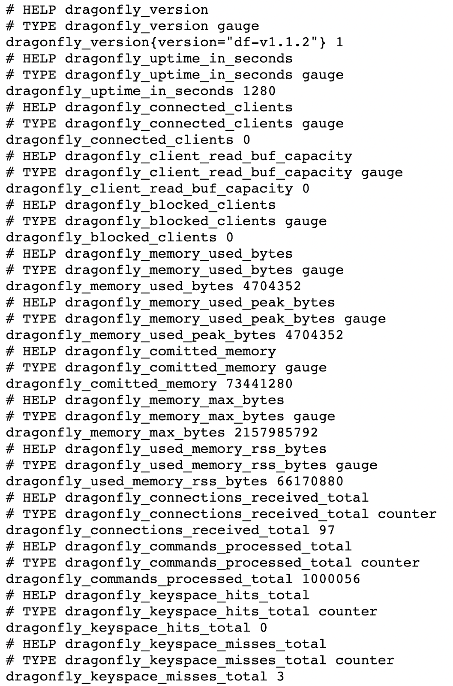
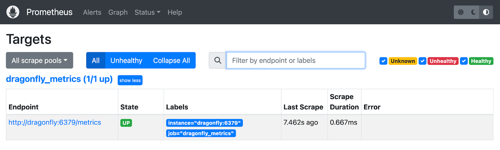
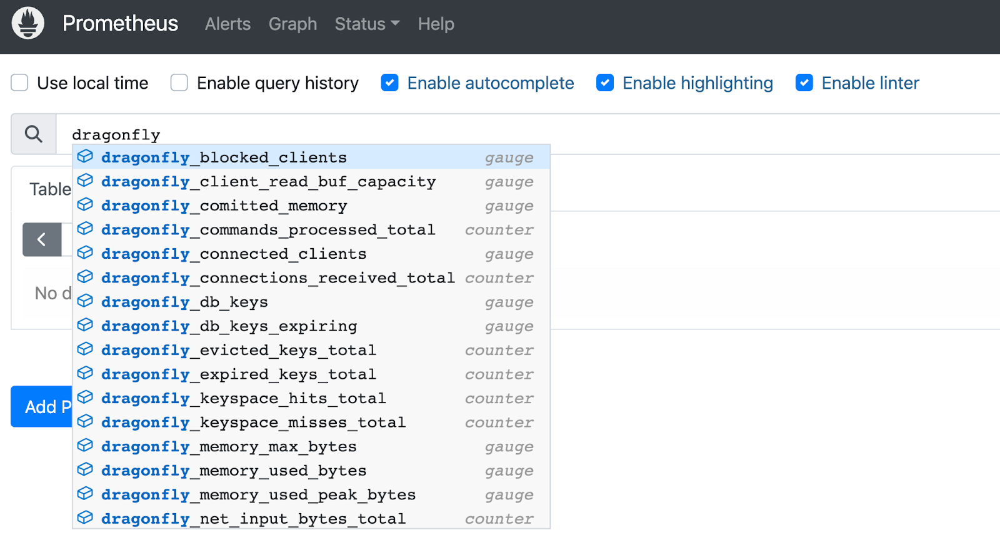
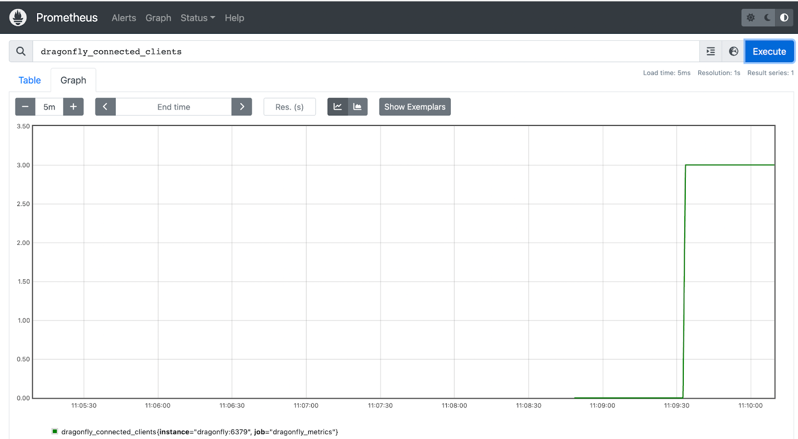
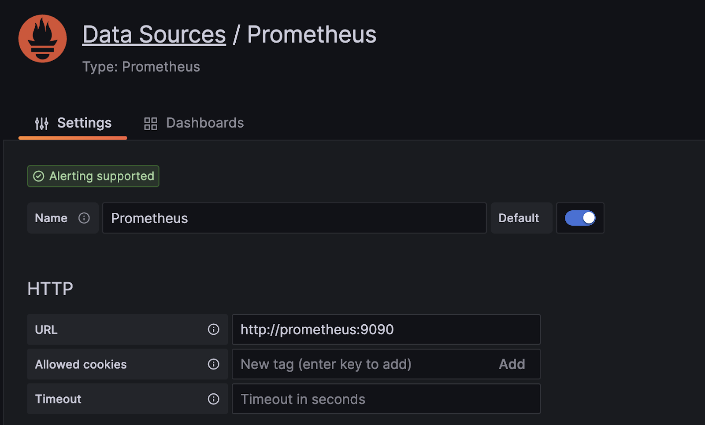
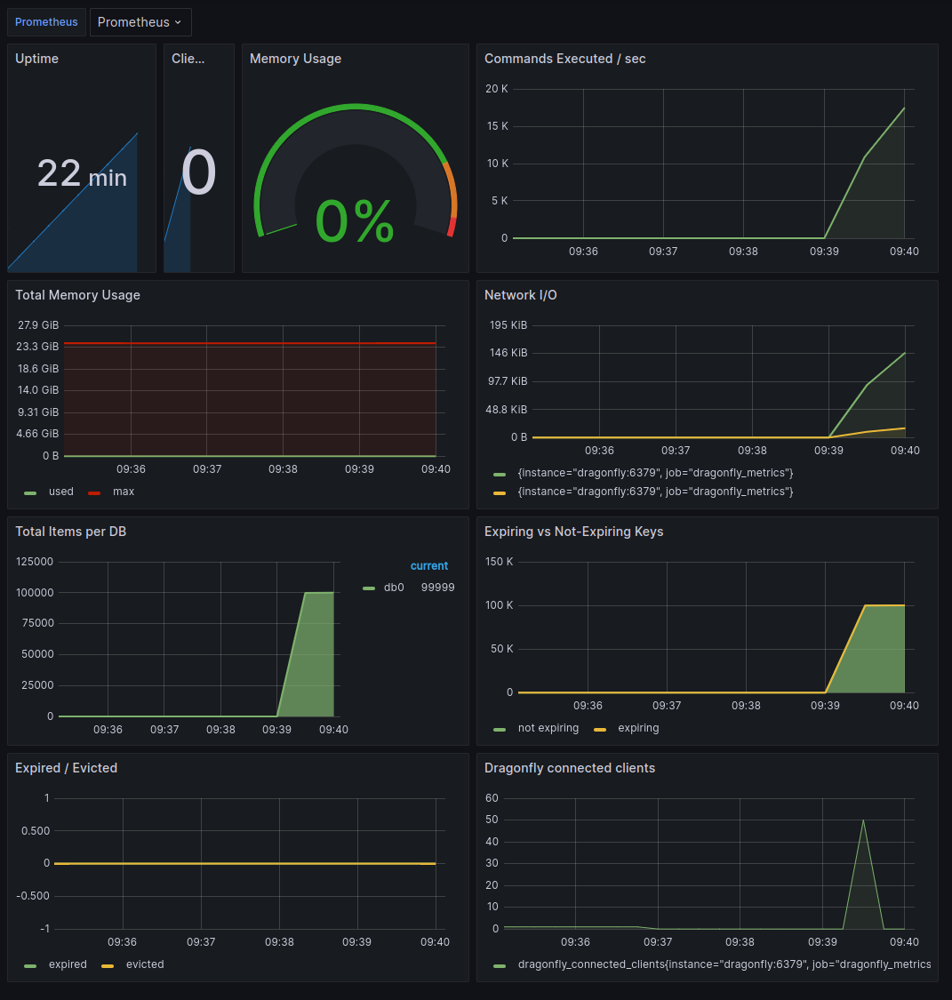

# 监控内存数据库
这篇博文介绍了监控内存数据存储，重点关注 Dragonfly。了解如何使用 Prometheus 和 Grafana 监控 Dragonfly 指标并在仪表板上可视化它们。探索内存消耗、客户端指标、服务器指标等。

[Tarun Pothulapati](https://www.dragonflydb.io/blog/authors/tarun-pothulapati)  2023 年 6 月 21 日


## **介绍**
监控内存数据存储需要采用与传统基于磁盘的数据库不同的方法。由于内存数据存储旨在将数据存储在 RAM 中，因此数据存储超出分配的内存限制的风险更大。发生这种情况时，数据存储可能必须逐出数据（例如，Redis 根据配置的策略（如 LRU）逐出Key），否则数据存储可能会变得不稳定或崩溃，从而导致数据丢失或停机。

因此，跟踪内存消耗是监控内存数据存储时的重点关注领域之一。但是，还需要考虑其他重要指标，包括可深入了解客户端应用程序如何使用数据存储的客户端指标以及其他服务器端指标（例如与 CPU 使用率相关的指标）。

在这篇博文中，我们将探讨如何 使用 [Prometheus监控](https://prometheus.io/)[Dragonfly](https://www.dragonflydb.io/)并添加 [Grafana](https://grafana.com/)进行可视化。

Dragonfly 是一种现代内存数据存储，它在多线程、无共享架构之上实现新颖的算法和数据结构。由于其[API 兼容性](/docs/command-reference/README.md)，Dragonfly 可以作为Redis 的*直接替代品*。截至撰写本文时，[Dragonfly 已实现了 200 多个 Redis 命令](/docs/documentation/Frequently-Asked-Questions.md#什么时候支持-x-命令) ，这代表了绝大多数用例的良好覆盖。由于 Dragonfly 的硬件效率，您可以在小型 8GB 实例上运行单节点实例，也可以垂直扩展到具有 64 核的大型 768GB 机器。这极大地降低了基础设施成本以及架构复杂性。


## **入门：使用 Prometheus 监控 Dragonfly**
Prometheus Exporter 可用于无法直接使用 Prometheus 指标检测给定系统的场景。它从特定系统或应用程序收集metrics信息，并以 Prometheus 可以抓取和摄取监控数据以进行监控和分析的格式展示。

Prometheus [Redis Metrics Exporter](https://github.com/oliver006/redis_exporter) 从 Redis 数据库中提取指标，并以 Prometheus 兼容的格式提供它们。但在我们的例子中，我们不需要它，因为 Dragonfly 公开了开箱即用的 Prometheus 兼容指标！（默认在 http://:6379/metrics 上可用）

尽管 6379 是默认端口，但您可以分别使用 --bind-admin 和 --bind-admin-port 标志来指定备用主机和端口。

让我们首先设置一个简单的环境来监控 Dragonfly。在此演示中，我们将运行一个 Dragonfly 实例，以及一个用于收集指标的 Prometheus 实例和用于可视化指标的 Grafana 实例。

开始之前，请确保已安装以下软件：Docker、Docker Compose 和 Redis CLI。

首先，让我们将 prometheus scrape 配置保存在名为 prometheus.yml 的文件中。该文件稍后会被挂载到prometheus容器中。

```yaml
global:
  scrape_interval: 15s

scrape_configs:
- job_name: dragonfly_metrics
  static_configs:
  - targets: ['dragonfly:6379']
EOF
```
接下来，我们将创建一个 docker-compose.yml 文件来定义我们需要的服务：

```yaml
cat <<EOF > docker-compose.yml
version: '3'

services:
  dragonfly:
    image: 'docker.dragonflydb.io/dragonflydb/dragonfly'
    pull_policy: 'always'
    ulimits:
      memlock: -1
    ports:
      - "6379:6379"
    volumes:
      - dragonflydata:/data

  prometheus:
    image: prom/prometheus:latest
    restart: always
    ports:
      - "9090:9090"
    volumes:
      - .:/etc/prometheus
    command:
      - '--config.file=/etc/prometheus/prometheus.yml'
    depends_on:
      - dragonfly

  grafana:
    image: grafana/grafana:latest
    restart: always
    ports:
      - "3000:3000"

volumes:
  dragonflydata:

EOF
```
使用 Docker Compose 启动 Dragonfly、Prometheus 和 Grafana：

```bash
docker compose -p monitor-dragonfly up
```
验证容器是否正在运行：

```bash
docker compose -p monitor-dragonfly ps
```
对于每个容器，您应该看到状态为正在运行：

|NAME|COMMAND|SERVICE|STATUS|PORTS|
| ----- | ----- | ----- | ----- | ----- |
|monitor-dragonfly-dragonfly-1|"entrypoint.sh drago…"|dragonfly|running (healthy)|0.0.0.0:6379->6379/tcp|
|monitor-dragonfly-grafana-1|"/run.sh"|grafana|running| |

要检查 Dragonfly 公开的指标，请 在浏览器中导航至[http://localhost:6379/metrics ：](http://localhost:6379/metrics)



要在 Prometheus 中查看这些指标，请导航至[http://localhost:9090](http://localhost:9090/)。从左侧菜单中选择状态 -> 目标：

搜索与 Dragonfly 相关的指标（它们以 Dragonfly\_ 前缀公开。）：





大多数指标可通过 [INFO](https://redis.io/commands/info/)命令获得。现在让我们更深入地研究其中的一些。

## **客户端相关指标**
**dragonfly\_connected\_clients**

Dragonfly\_connected\_clients 指标是指当前与 Dragonfly 建立的客户端连接数。它包括活动连接和空闲连接，并且随着时间的推移对其进行监控可以深入了解使用模式和趋势。

让我们使用三个不同的 redis-cli 客户端连接到 Redis 实例，并查看connected\_clients 的值：

```bash
redis-cli -p 6379
```
几秒钟后，dragonfly\_connected\_clients 的值应该为 3，您应该在 Prometheus 中看到这一点：



监控此指标可以帮助识别潜在的性能和可扩展性问题，特别是对于未正确关闭连接的客户端。 **dragonfly\_blocked\_clients**

Dragonfly\_blocked\_clients 指标是指当前正在等待 Dragonfly 阻塞调用的客户端连接数，例如 BLPOP、BRPOP、BRPOPLPUSH 等。

让我们使用以下命令打开几个 redis-cli 客户端来阻止列表：

```bash
blpop test_list 15
```
Dragonfly\_blocked\_clients 指标应该会出现峰值。

*15 秒后它应该降至 0（因为这是我们在 blpop 命令中指定的超时）。*

## **服务器指标**
让我们看看 Dragonfly 服务器相关指标。对于其中大多数，您可以记下初始值，然后执行一些操作来查看指标值的变化。该操作可以是使用任何Redis client的简单客户端操作，也可以使用Redis基准测试工具进行负载测试（例如redis-benchmark -t set -r 100000 -n 1000000）

**内存相关**

* Dragonfly\_memory\_used\_bytes - 这是 Redis 使用其分配器分配的字节总数。请注意，这是指 INFO 命令中的used\_memory 指标。
* Dragonflyused\_memory\_rss\_bytes \_- rss 代表 \_resident 集大小\_，该指标是指操作系统看到的 Dragonfly 分配的字节数。这是 top(1) 和 ps(1) 等工具报告的数字。请注意，这是指 INFO 命令中的used\_memory\_rss 指标。
* Dragonfly\_memory\_max\_bytes - 这是 maxmemory 配置指令的值。请注意，这是指 INFO 命令中的 maxmemory 指标。

**Key相关**

* Dragonfly\_db\_keys - 这是特定数据库中的键总数。
* Dragonfly\_expired\_keys\_total - 这是密钥过期事件的总数。请注意，这是指 INFO 命令中的 expired\_keys 指标。如果您向 Dragonfly 添加一个带有生存时间 (TTL) 值的密钥，则它们会在 TTL 过后被服务器自动删除。该指标计算已达到 TTL 并被删除的键的数量。您可以使用 EXPIRE 命令使密钥过期并查看该指标的变化。
* Dragonfly\_evicted\_keys\_total - 这是由于最大内存限制而被逐出的键的总数。


## **使用 Grafana 可视化 Dragonfly 指标**
[导航到位于http://localhost:3000/](http://localhost:3000/)的 Grafana 控制台（使用 \_admin/admin\_作为凭据），然后首先添加 Prometheus 作为数据源。

* 从**添加数据源中**，选择\_Prometheus\_
* 输入[http://prometheus:9090](http://prometheus:9090/)作为 URL
* 选择**保存并测试**



虽然您可以构建自己的 Grafana 仪表板，但现在让我们利用现成的仪表板：

* [使用此链接](https://gist.github.com/Pothulapati/927122bdfcc32cf0bff591f791638cda)下载 Dragonfly Grafana 仪表板
* 单击侧面菜单中的**仪表板 > 导入，然后上传您下载的 Dragonfly-** \_dashboard.json\_文件。
* 在下一个屏幕上，选择您刚刚创建的 Prometheus 数据源，然后单击**Import**。

要试验仪表板，您可以使用任何 Redis 客户端或 Redis 基准测试工具执行简单的客户端操作，如下所示：

```bash
redis-benchmark -t set -r 100000 -n 1000000
```
您现在应该看到包含 Dragonfly 指标的仪表板：



完成本教程中的步骤后，请使用以下命令停止 Docker 容器：

```bash
docker compose -p monitor-dragonfly down -v
```
## **结论**
在这篇博文中，我们探讨了如何使用 Prometheus 监控 Dragonfly 指标，并与 Grafana 集成以在仪表板上可视化指标。

如果您想了解更多信息，请查看我们有关[如何启动 DragonflyDB 实例的](/docs/getting-start/README.md)文档，带上 [您选择的客户端](/docs/development/SDKs.md) 并开始使用熟悉的[Redis 命令](/docs/command-reference/README.md)进行构建！


