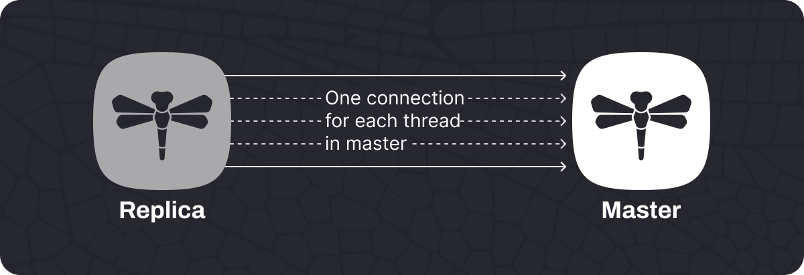
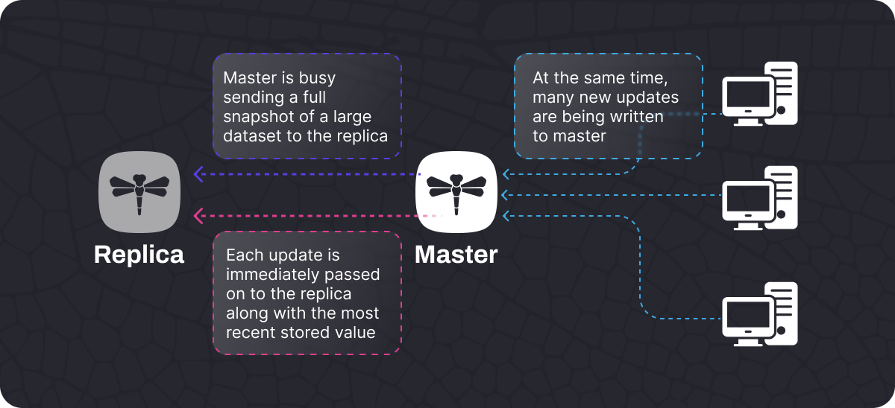
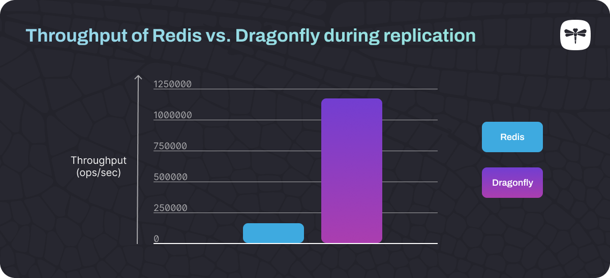
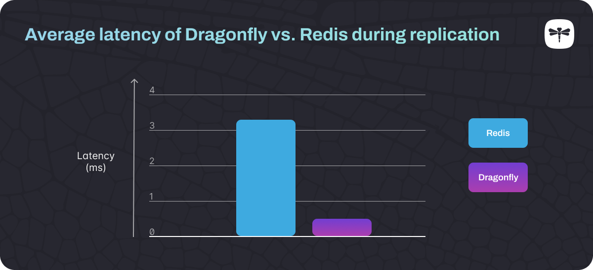
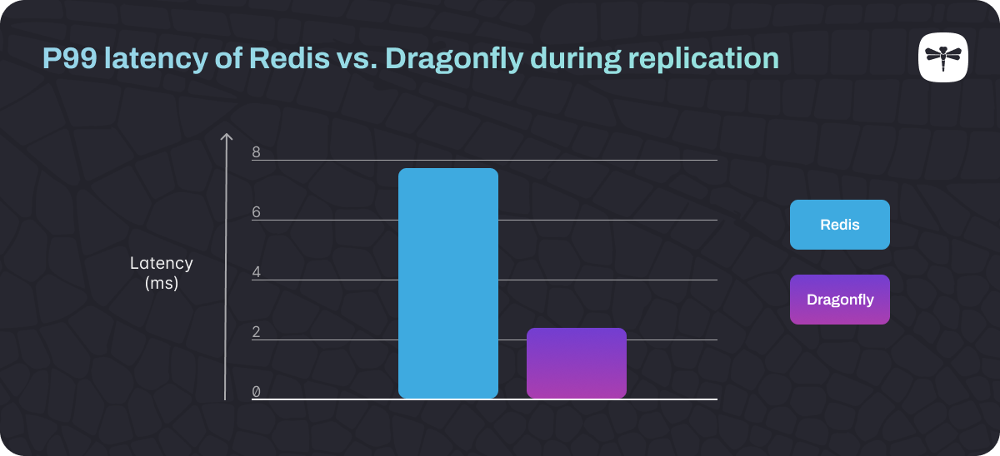
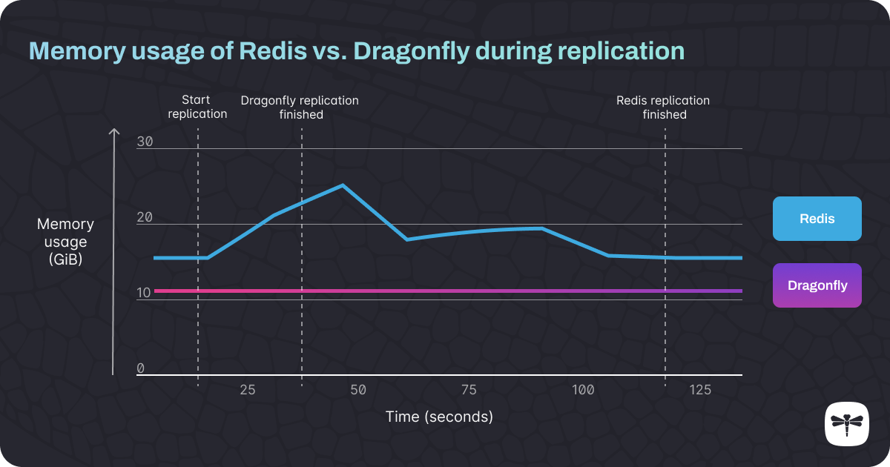

# Dragonfly 内存数据库现在支持复制以实现高可用性
Dragonfly 是一款内存数据库，可以直接替代 Redis，现在在其 1.0 版本中支持复制以实现高可用性。

[Adi Holdengreber](https://www.dragonflydb.io/blog/authors/adi-holdengreber)   2023 年 5 月 23 日

Dragonfly 是一种高性能内存数据库，可以作为 Redis 的直接替代品。Dragonfly 1.0 版本已做好生产准备，包括数据库复制，可以轻松从 Redis 迁移并适合高可用性部署。

高可用性是指系统连续运行的能力（无停机或故障），最好通过使用内置的[故障转移](https://www.techtarget.com/searchstorage/definition/failover)机制而不是过度配置。高可用性对于任何现代应用程序都很重要：从社交媒体到重要的财务软件应用程序，用户期望高性能的应用程序不会停机。

Dragonfly 的复制过程快速且内存可靠，并且支持高吞吐量。这使得它非常适合高可用性解决方案，特别是在现有 Redis 部署陷入困境的情况下。

Dragonfly 提供与 Redis 完全兼容的 API，使迁移变得容易。这意味着您可以将其与现有应用程序和库一起使用，而无需进行任何代码更改。

在本文中，我们将解释什么是数据库复制以及如何利用它来提高可用性。我们还解释了 Dragonfly 中的复制过程如何工作以及它与 Redis 中的复制有何不同。最后，我们将介绍如何在 Dragonfly 中配置和管理复制。

## 什么是数据库复制？
数据库复制是将主数据库的内容连续复制到副本数据库的过程，副本数据库通常运行在不同的服务器上。保留同一数据库的多个副本可以让您的系统避免单点故障 - 如果您的主节点发生故障，副本可以自动提升为新的主节点，成为数据写入的新目的地和任何其他数据的源剩余的副本。这使得系统能够从故障中恢复，而不会丢失数据、降低性能或停机。

## 复制如何帮助实现高可用性？
数据库复制是任何高可用内存数据库系统的基础之一。如果没有适当的复制，如果数据库崩溃，您将必须手动从备份恢复。这非常耗时，更糟糕的是，您将丢失自上次备份以来写入数据库的所有数据。通过可靠的数据库复制实施，包括检测不稳定或故障的监控系统，您的应用程序将能够通过自动回退到副本节点并继续正常运行来处理主数据库节点故障。

## Dragonfly 复制的工作原理
对于开发人员来说，Dragonfly 中的复制与 Redis 复制的工作方式相同，实现完全相同的 API 以实现兼容性也比较易于学习。然而，底层代码都是Dragonfly。主要区别之一是 Dragonfly 的[快照算法](/blogs/balanced-vs-unbalanced.md)，它使复制变得可靠，而不会显着影响性能。

Dragonfly 使用一种[无​​共享架构](https://en.wikipedia.org/wiki/Shared-nothing_architecture)，允许通过不同的连接并行复制数据，每个线程一个连接。这种无共享架构之所以成为可能，是因为 Dragonfly 被设计为允许多线程，从而使其速度超快。存储的数据分布在 Dragonfly 内的不同[分片中](https://en.wikipedia.org/wiki/Shard_(database_architecture))，每个分片持有一组不同的Key。作为 Dragonfly 多线程设计的一部分，每个线程负责一个特定的分片并在该分片上执行操作，例如复制分片的数据。

为了开始复制，会发生握手动作，其中在副本和主服务器之间打开每个[分片](https://en.wikipedia.org/wiki/Shard_(database_architecture))线程的连接，以将数据发送到副本。

####### 副本与主节点建立连接并交换元数据详细信息
一旦建立这些连接，会出现“full synchronization”阶段。这是整个数据集从主服务器复制到副本的地方。复制完整数据库快照时主数据库发生的任何更新都会并行发送到副本。由于 Dragonfly 的快照算法使用[纤程](https://en.wikipedia.org/wiki/Fiber_(computer_science))，快照和更新是并行发生的。

######## 更新与完整快照一起推送到副本，这可以节省大量内存并使进程更加稳定。
当每个分片完成其full sync的部分时，它将其状态更改为 “***流状态***”，这意味着它已准备好开始向副本发送更新的最终“stable synchronization”阶段。一旦所有分片都处于这种状态，“stable synchronization”阶段就开始了。

stable sync 阶段是 Dragonfly 复制的标准运行阶段。每次master数据库有更新时，更改都会异步传输到副本。

## Dragonfly 中的复制与 Redis 中的复制有何不同
Redis 在其复制过程中使用单线程，而 Dragonfly 是多线程的，并且能够使用可用于复制过程的所有 CPU 线程。正因为如此，Dragonfly 可以 ***并行 ***复制分片数据，使得复制速度超快。

Dragonfly 高效的快照算法允许它在发送完整快照的同时向副本发送更新命令。然而，Redis 首先发送完整快照，并将更新命令存储在内存缓冲区中，稍后可以将其发送到副本（快照完成后）。

Redis 的复制方法可能会导致较大的内存峰值，如下所示。发生这种情况是因为它使用了惰性[写时复制](https://en.wikipedia.org/wiki/Copy-on-write)操作，这会导致内存页重复。这意味着随着数据库大小的增加，小量写入​​可能会使用大量内存。反过来，这会导致内存快速达到 100% 容量，从而导致较大的延迟峰值。

Redis 的内存使用量在复制期间加倍是很常见的。这种情况可能会出现大峰值，从而难以预测内存使用情况。因此，如果您使用 Redis，则需要过度配置其服务器，以避免系统内存不足和崩溃的可能性。在 Dragonfly 中，复制的内存开销是恒定的，并且不受数据集大小的影响。这使得它适合需要高可用性但不适合持续在线有多余容量来处理意外流量峰值的情况。

最后一个值得一提的问题是 Redis 复制可能发生的问题是，在将快照复制到副本时用于存储更新的缓冲区的大小是有限的：工作负载越高，该缓冲区完全填满的可能性就越大。如果发生这种情况，复制过程将完全重新启动。此后，完全相同的问题将再次发生：缓冲区将达到容量并且复制将重新启动，从而导致[无限的复制循环](https://redis.com/blog/the-endless-redis-replication-loop-what-why-and-how-to-solve-it/)。在 Dragonfly 的快照算法中，不需要复制缓冲区。相反，它会立即将更新发送到副本。这使得复制过程非常稳定，服务器在复制数据时可以处理高工作负载。

## Redis 和 Dragonfly 的比较 — 基准测试
我们在复制过程中对Redis和Dragonfly的性能进行了一些测试。这些测试在具有 36 个虚拟 CPU 和 96 GiB RAM 的 AWS c5n.9xlarge 实例上托管的 Redis 和 Dragonfly 单个实例上运行。我们使用 Redis Labs 的[memtier\_benchmark](https://github.com/RedisLabs/memtier_benchmark)工具来执行测试。

这些测试结果表明，Dragonfly 的吞吐量比 Redis 快 7.6 倍，而平均延迟低 7.6 倍，尾部（P99）延迟低 3.3 倍。此外，Dragonfly 的复制“full sync”阶段比 Redis 快 5.5 倍，并且与 Redis 不同，Dragonfly 在全量复制阶段没有明显的内存峰值。

####### 复制运行时，Dragonfly 的吞吐量为每秒 1,205,511.27 次操作，而 Redis 的吞吐量为每秒 159,222.92 次操作。

######## Dragonfly 复制运行时的平均延迟为每秒 0.44763 毫秒，Redis 为 3.39067 毫秒，这表明可以实现高吞吐量和低延迟。

####### Dragonfly 复制运行时的 P99 延迟为每秒 2.399 毫秒，Redis 为 7.839 毫秒。Dragonfly 中的尾部延迟较低，因为它的复制过程不会导致内存峰值。

####### Dragonfly 的“完全同步”复制比 Redis 快 5.5 倍，虽然 Redis 在复制过程中会遇到较大的内存峰值，但 Dragonfly 没有明显的内存峰值。
## 如何配置和管理 Dragonfly 复制以实现高可用性
我们的[复制文档](/docs/managing-dragonfly/Replication.md)提供了如何管理 Dragonfly 复制以及使用复制从 Redis 迁移到 Dragonfly 的完整详细信息。Dragonfly 复制管理 API 与 Redis API 完全兼容，由两个面向用户的命令组成：ROLE 和 REPLICAOF (SLAVEOF)。

[您可以使用Redis Sentinel](https://redis.io/docs/management/sentinel/)等高可用性监控系统来自动管理故障转移，而不是直接使用 API。Dragonfly 与 Redis Sentinel 完全兼容，它可以检测主实例何时发生故障，并自动将副本提升为下一个主节点。

## Dragonfly 已准备好简化您的内存数据库操作
Dragonfly 的 1.0 GA 版本现在包含对复制的全面支持，使其非常适合高可用性部署。它速度快、内存可靠且易于管理，可垂直扩展以支持每秒数百万次操作和 TB 级工作负载。它在单个实例上完成这一切，因此您无需管理集群。

由于 Dragonfly 具有与 Redis 相同的 API，因此您可以在生产环境中将其用作直接替代品。

您只需几分钟即可[开始在 Docker 化容器中使用 Dragonfly ，并且您将能够立即看到它的执行速度。](/docs/getting-start/README.md)我们还在[此处](/blogs/scaling-performance-redis-vs-dragonfly.md)发布了与 Redis 的一些关键性能比较。

