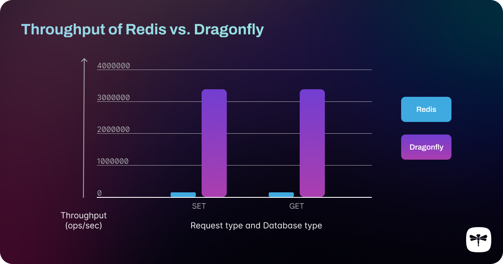
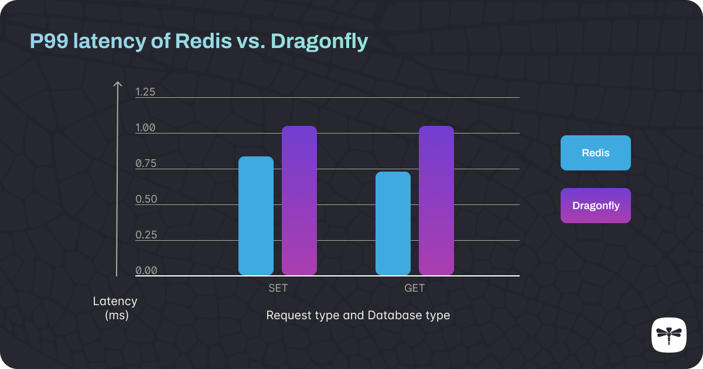
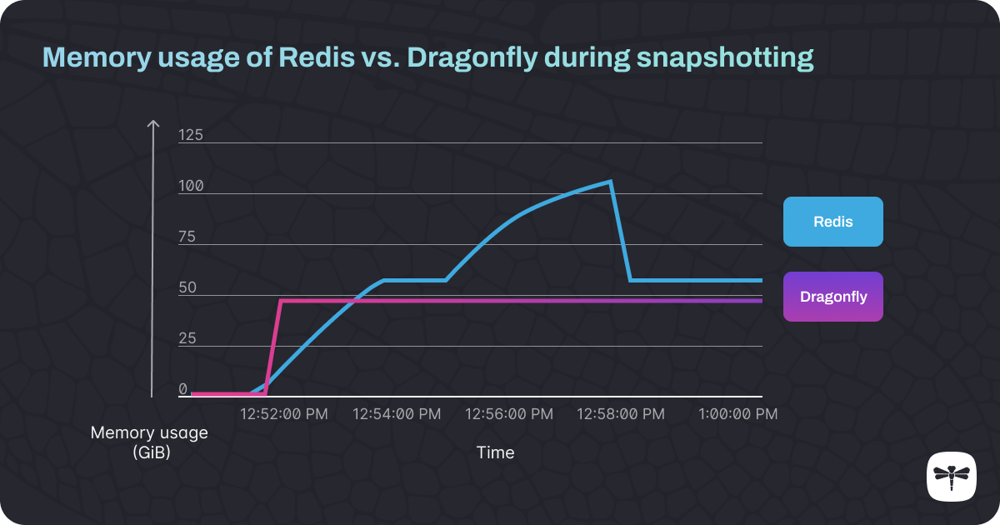

# Redis 与 Dragonfly 的可扩展性和性能
Redis 和 Dragonfly 之间的吞吐量、延迟和内存利用率的全面基准比较。

内存数据库已成为支撑现代、面向性能的应用程序的最重要的基础设施之一。Redis 因其简单性而成为其中最受欢迎的——它设置快速、易于使用并且可扩展以满足不断增长的业务的需求。

然而，Redis 是十多年前设计的，由于其简单的单线程架构，扩展 Redis 部署对于开发人员来说可能是一个漫长而令人沮丧的经历。扩展和维护 Redis 集群非常复杂且耗时，如果您没有正确维护 Redis 集群，则可能会丢失数据，从而导致用户体验问题甚至站点中断。

或者，您可以使用[Dragonfly](https://github.com/dragonflydb/dragonfly)。Dragonfly 是 Redis 和 Memcached 的直接替代品——它是一种现代内存数据库，其开发是为了在其前辈的成功基础上发展，同时提高性能和可靠性。其多线程架构允许更有效的垂直扩展，因此您可以避免水平扩展和集群管理带来的麻烦，同时仍然享受扩展网站的好处。

在本文中，我们将解释 Dragonfly 的主要功能，并展示它在吞吐量、延迟和内存使用情况的基准测试中与[Redis（OSS 版本）](https://redis.io/)相比的表现。

## Redis：启动和运行简单，扩展复杂
Redis 是单线程的，这意味着它一次只能做一件事。即使它运行的机器有多个核心，它也无法利用它们并行的执行多个任务。虽然 Redis 可以垂直扩展（通过增加其运行的硬件的内存和处理器速度），但性能的提升很快就会趋于稳定——在单线程进程中投入更强大的多线程处理能力不会带来任何好处和更快。

要突破此限制，唯一的选择是水平扩展 - 添加更多 Redis 服务器，每个服务器运行一个单线程 Redis 进程 - 并将它们作为集群的一部分进行管理。Redis 集群非常难以设置和维护（不健康的节点无法轻松更换，必须手动配置，并且必须在每个节点上单独配置快照），并且它们增加了基础设施的复杂性，这意味着您最终可能需要专家DevOps 人员负责运行和维护您的集群。

维护笨重的 Redis 集群更加令人沮丧，Redis 可能会耗尽内存并崩溃，导致您丢失所有数据。Redis需要运行许多后台进程来维持健康状态，并且工作负载往往会变得过大，其单个CPU核心无法处理，从而[导致数据库崩溃](https://www.figma.com/blog/postmortem-service-disruptions-on-june-6-and-7-2022/)。如果发生这种情况，您的网站可能会崩溃，或者可能会对用户体验产生其他严重影响。这种不稳定性意味着定期对 Redis 数据库进行快照以避免丢失数据非常重要，但不幸的是快照过程本身也使用大量内存，使您再次面临崩溃的风险。

为了解决这些资源和稳定性问题，由于担心数据丢失，Redis 用户往往会大量过度配置服务器——要么拥有比实际需要更多的集群节点，这会影响延迟，要么他们通常需要配置比实际需要大得多的内存容量的机器。他们通常最终会支付所需 RAM 量的数倍费用，只是为了弥补快照带来的内存峰值。

Redis 也会受到定期[延迟峰值](https://about.gitlab.com/blog/2022/11/28/how-we-diagnosed-and-resolved-redis-latency-spikes/)（[https://about.gitlab.com/blog/2022/11/28/how-we-diagnosed-and-resolved-redis-latency-spikes/](https://about.gitlab.com/blog/2022/11/28/how-we-diagnosed-and-resolved-redis-latency-spikes/)）的影响。由于它是单线程的，因此任何需要定期运行的后台进程都会导致延迟大幅增加，因为没有其他线程可以完成这项工作。在高延迟期间，吞吐量会下降。如果这种情况经常发生，您的用户可能会对看起来不稳定的系统感到恼火。

尽管 Redis 仍然很受欢迎，但这些问题仍未得到解决，并继续浪费许多组织的时间和资源。我们对 Redis 的不满促使我们开发了自己的直接替代品，以解决 Redis 用户面临的最常见问题。

## Dragonfly 解决了 Redis 的最大问题
Dragonfly 是 Redis 的直接替代品，可简化生产并提高性能。它[可以垂直扩展，](https://www.cloudzero.com/blog/horizontal-vs-vertical-scaling)（[https://www.cloudzero.com/blog/horizontal-vs-vertical-scaling](https://www.cloudzero.com/blog/horizontal-vs-vertical-scaling)）以支持单个实例上每秒数百万次的操作和 TB 级的工作负载。

与 Redis 的单线程进程相比，Dragonfly 通过其多线程处理能力利用了所有可用的硬件资源。这使得它可以垂直扩展，从而在高规格机器上实现更高的吞吐量，而无需管理集群的压力。Dragonfly 能够充分利用所有可用的 CPU 核心，这也使其运行成本更低，因为您可以部署比 Redis 所需的更小的 Dragonfly 实例大小（对于相当大小的数据），并且只需升级您的服务器规格当需要额外资源时。

我们希望每个人都能享受到我们更快、更可靠的内存数据库带来的好处，因此我们让 Dragonfly 受到商业源代码许可的约束，这意味着使用它不需要任何成本，并且源代码是可用的。您可以[在 GitHub 上查看代码](https://github.com/dragonflydb/dragonfly)并立即安装。

## Dragonfly 和 Redis 的基准比较
为了展示 Dragonfly 相对于 Redis 的显着性能优势，我们在此与您分享我们的基准测试结果。为了进行最直接的比较，我们将单个 Redis 实例与单个 Dragonfly 实例进行了比较。

[我们在AWS Graviton2 EC2 实例](https://aws.amazon.com/ec2/graviton/)上运行了测试，这些实例经过网络优化，可为 Web 应用程序提供最佳性能。我们使用[memtier\_benchmark](https://github.com/RedisLabs/memtier_benchmark)（Redis Ltd. 开发的一种广泛使用的基准测试工具）来测试吞吐量和延迟，并使用[Prometheus](https://prometheus.io/)来监控和可视化内存使用情况。

### 测试#1：吞吐量
数据库的吞吐量是通过每秒可以处理的操作数来衡量的。这是数据库性能最重要的指标之一。

我们在 Redis 和 Dragonfly 数据库中分别填充了 1000 万个键，以模拟正在使用的数据库，然后针对 Redis 和 Dragonfly 实例运行 memtier\_benchmark 测试。

从下图可以看出，多线程Dragonfly的吞吐量远远超过了Redis。

####### 对于 GET 和 SET 操作，Dragonfly 的吞吐量远远高于 Redis。
#### 如何为自己重复这些测试
如果您想在自己的基础设施上测试这些性能提升，您可以遵循本指南：

* 将 Redis 版本 7.0.4 和 Dragonfly 版本 0.15.0 安装到单独的 AWS EC2 实例上（我们使用[c6gn.16xlarge](https://instances.vantage.sh/aws/ec2/c6gn.16xlarge)）。
* 编辑Redis配置文件：
   * protected-mode no\_这允许您从 Redis 服务器外部运行 memtier\_benchmark 命令。
   * 将绑定 127.0.0.1\_更改为\_绑定 0.0.0.0\_这也用于协助远程 Redis 连接。
   * save ""\_这将禁用快照。
   * enable-debug-command yes\_这将启用调试命令，您可以使用这些命令将虚拟数据添加到数据库。
* 使用以下命令启动 Dragonfly：
   * ./dragonfly-aarch64 --proactor\_threads=64\_该参数指定将分配给 Dragonfly 的线程数量。
* \* 启动 Redis。
* 每个数据库填充 1000 万个键，以模拟正在使用的数据库。 *调试填充 10000000 键 550*
* 为每个数据库运行此 memtier\_benchmark 命令：
   * *memtier\_benchmark -p 6380 --ratio=<1:0 对于 GET，0:1 对于 SET> --hide-histogram --threads=<2 对于 Redis，64 对于 Dragonfly> --clients=30 --requests=200000 - -distinct-client-seed --data-size 256 --expiry-range=500-500 -s <Redis/Dragonfly 服务器的 IP 地址>*

memtier\_benchmark 是一个多功能工具，因此如果您想调整测试参数以反映您自己的使用场景，请务必查看[用户手册。](https://redis.com/blog/memtier_benchmark-a-high-throughput-benchmarking-tool-for-redis-memcached/)

### 测试#2：延迟
数据库延迟是衡量操作完成所需时间的指标。当数据库具有高吞吐量时，这通常会影响其延迟，因为向数据库写入更多数据可能会导致延迟。考虑系统的[尾部延迟尤为重要。](https://robertovitillo.com/why-you-should-measure-tail-latencies/)（[https://robertovitillo.com/why-you-should-measure-tail-latencies/](https://robertovitillo.com/why-you-should-measure-tail-latencies/)）尾延迟关注的是花费最长时间完成的操作，而不是总体平均时间。尾部延迟是针对较高的百分位进行测量的 - 例如，P99 延迟是对最长 1% 的请求完成所需时间的测量。

尾部延迟是一个重要的衡量指标。如果百分之一甚至万分之一的操作速度慢得令人无法接受，那么（取决于您的流量）大量用户可能会受到影响，从而削弱对您的产品或服务的信心。服务级别协议 (SLA) 要求产品的第 99 个百分位数的响应时间低于特定阈值，这一点变得越来越普遍。

Dragonfly 虽然提供高达 Redis 30 倍的吞吐量，但对于最慢的 1% 请求，延迟并未显着增加。

下面，我们绘制了 Dragonfly（使用 64 核）和 Redis 的 P99 延迟测试结果。值得注意的是，我们在延迟测试中使用了与吞吐量测试**完全相同的memtier\_benchmark 命令。**

####### 即使吞吐量是 Redis 的 25-30 倍，Dragonfly 的 P99 延迟也仅比 Redis 高一点点。
**该图显示，尽管 Dragonfly 的吞吐量大幅增加，但 Dragonfly 的 P99 延迟仅略高于 Redis** - 值得注意的是，如果我们降低 Dragonfly 的吞吐量以匹配 Redis 的吞吐量，则 Dragonfly 的 P99 延迟将比 Redis 低得多。这意味着 Dragonfly 将为您的应用程序性能带来显着改进。

### 测试#3：快照过程中的内存效率
[众所周知，](https://medium.com/@bb8s/how-redis-cluster-achieves-high-availability-and-data-persistence-8cdc899764e8)在创建数据库快照时，Redis 的执行速度特别慢，因为其大部分内存被重定向到快照进程。由于效率提高，Dragonfly不会遇到这个问题。下面，我们的图表通过比较运行 Redis bgsave 和 Dragonfly save 命令（启动各自数据库的快照过程）时发生的情况，展示了 Dragonfly 在快照时的效率有多高。

####### 首先，大量记录添加到Redis和Dragonfly中，导致两者的内存使用量分别增加到56和48 GiB。接下来，为两者启动快照过程。这导致 Redis 的内存大幅飙升，而 Dragonfly 的内存没有显着变化。
**我们的结果表明：**

* **对于相同的数据集，Dragonfly 本质上具有较小的内存使用量。**
* **Dragonfly 在加载数据集和生成快照方面都更快。**
* **Dragonfly 的内存使用量在快照过程中不会增加，而 Redis 的 RAM 需求几乎增加了一倍。**

#### 如何为自己重复这些测试
* 将 Redis 版本 7.0.4 和 Dragonfly 版本 0.15.0 安装到单独的 AWS EC2 实例上（我们使用[r6gd.4xlarge](https://instances.vantage.sh/aws/ec2/r6gd.4xlarge)）。
* 编辑Redis配置文件：
   * protected-mode no\_这允许您从 Redis 服务器外部运行 memtier\_benchmark 命令。
   * 将绑定 127.0.0.1\_更改为\_绑定 0.0.0.0\_这也用于协助远程 Redis 连接。
   * enable-debug-command yes 这将启用调试命令，您可以使用这些命令将虚拟数据添加到数据库。
* 使用以下命令启动 Dragonfly：
   * *./dragonfly --dir "/mnt/vol1/"*\* 启动 Redis。
* 每个数据库填充 1 亿个键，以模拟正在使用的数据库。
   * *调试填充 100000000 key 500*
   * 有关更多详细信息，请参阅我们的[快照视频](https://www.youtube.com/watch?v=fEwU-hwtfwQ)演示。

### Redis 与 Dragonfly 基准测试：结果摘要
正如上面的基准测试结果所示，**Dragonfly 的性能远远优于 Redis**。Dragonfly 吞吐量比 Redis 高出 30 倍，而同时 P99 延迟仅增加 0.2ms 左右。

另一个影响较大的性能改进是快照过程（在 Redis 中占用了大量内存）不会导致 Dragonfly 中的内存使用量出现明显的峰值。

如果您正在部署新的应用程序，或者希望扩展现有的 Redis 部署，无论是在内存数据库的初始实施中还是在持续的扩展和维护任务中，Dragonfly 都可以节省您的时间和资源。Dragonfly 是 Redis 的高性能替代品，不会出现资源耗尽的情况，并且可以随着您的产品的增长而扩展。

## Dragonfly 与 Redis 兼容，具有更好的性能和轻松的扩展
我们构建 Dragonfly 是为了解决 Redis 普遍存在的性能问题，正如我们的结果所示，我们已经成功了。

Redis 是一项令人惊叹的技术，已被数百万开发人员用来快速启动和运行缓存。我们构建 Dragonfly 是为了让开发人员拥有同样易于使用、但性能更好且更可靠的东西。

从 Redis 轻松切换到 Dragonfly 是解决 Redis 可扩展性和饱和问题的一个很好的一步解决方案。[通过运行Dragonfly 的 Docker 版本](/docs/getting-start/install-with-docker.md)并使用与调用 Redis 完全相同的命令来调用它，您可以在几分钟内轻松开始。