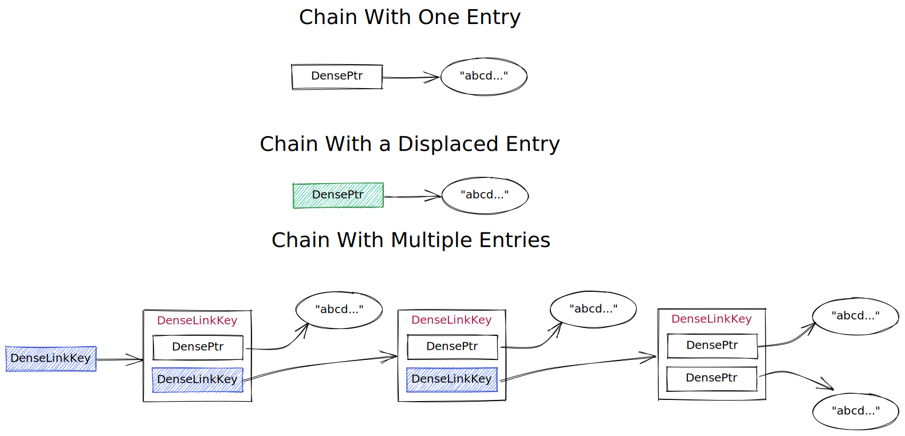

# Dragonfly 中的 DenseSet

`DenseSet` 使用类似于 Redis 字典的 [经典哈希表链接法](https://en.wikipedia.org/wiki/Hash_table#Separate_chaining) 来查找集合中的项目。

`DenseSet` 中的主要优化是指针能够 **指向对象或者一个链接 key**，无需为每一个 entry 分配一个 set entry ，这是通过 [指针标记](https://en.wikipedia.org/wiki/Tagged_pointer) 来实现的，该标记利用了任何用户空间地址的前 12 bits 都未被使用的事实， 可以设置为指示当前指针是否指向任何内容， 一个链接key ，或者一个对象。

以下是指针中每个 bit 的用途

| Bit 索引 (from LSB) | 含义 |
| -------------------- |-------- |
|       0 - 52         | 用户空间数据的内存地址 |
|          53          | 指示 `DensePtr` 是否指向存储 `DenseSet` 在链中的上一个或者下一个链接中的数据 |
|          54          | 位移位。 指示现在的 entry 是否位于数据哈希定义的正确列表中 |
|          55          | 位移方向，位移位被设置时才有意义。0 表示该 Entry 位于其正确列表的左侧，1 表示该条目位于正确列表的右侧。 |
|       56 - 63        | 未使用过 |

此外，为了减少冲突，可以将项目插入到空的主链 (由哈希指定的链) 的相邻位置中，以减少未使用空间的数量。 然后使用指针标记将这些 Entry 标记为已移位。

下面是可能的 bucket 配置的示例。

 

*使用 [excalidraw](https://excalidraw.com)创建*

### 插入
要将一个 entry 插入一个 `DenseSet` 将采取以下步骤：

1. 检查 set 中是否存在该 entry ，如果存在将返回 false
2. 如果该 entry 不存在，则在哈希索引 ± 1 处寻找空链， 优先考虑主链。如果找到空 entry，该 item 将被插入并返回 true
3. 如果步骤 2 失败并且满足增长的前提下，则增加表中的 bucket 数， 然后重复步骤 2
4. 如果步骤 3 失败，则尝试将 entry 插入主链中。
    - 如果主链没有被替换的 entry 占用，则将新 entry 插入到列表的前面
    - 如果主链被替换的 entry 占用，则将替换的 entry 移动到主链。 如果被替换的 entry 的主链被第二个被替换的 entry 占据，这可能会导致多米诺骨牌效应，从而导致 `O(N)` 复杂度。 "修复"

### 查询
查找一个 `DenseSet` 中的 entry:

1. 检查主链和相邻链中的第一个 entry 是否有匹配的 entry。
2. 如果步骤 1 失败，则迭代搜索 entry 的主链并检查是否相等。

### 待改进
一些进一步的改进包括 `DenseSet` 允许 entry 被插入它们的主链中，而无需当前 `O(N)` 的步骤来修复移位的 entry。通过在 entry 被替换后，在主链插入一个 entry， 而不是修复被替换的 entry， 搜索所产生的额外开销最小，并且插入新 entry 时不会产生多米诺骨牌效应。为了最终将位移的 entry 移至它的主链， 可以实施多种启发式方法，包括:

- 当 entry 被删除时，如果链变空并且相邻链中存在移位 entry，则将其移动到现在空的主链
- 如果搜索结果发现被替换的 entry 并且是具有多个 entry 的链的根，则应该将被替换的节点移动到其主存储桶

## 基准测试

在 100% 利用率下，Redis 字典实现每条记录使用大约 32 个字节 ([请阅读细分以获取更多信息](./dashtable.md#redis-dictionary))

与使用相邻单元相比， `DenseSet`  在充分利用时，大约有 ~21% 的空间未使用， 从而导致 $N\*8 + 0.2\*16N \approx 11.2N$ 或者每条记录约 ~12 bytes， 节省约 ~20 字节。随着利用率的降低，每条记录保存的字节数会增加

命令 `memtier_benchmark -p 6379 --command "sadd __key__ __data__"   -n 10000000 --threads=1 -c 1 --command-key-pattern=R   --data-size=10     --key-prefix="key:"  --hide-histogram --random-data --key-maximum=1 --randomize --pipeline 20`
生成两个集合 entry 其中包含许多比较小的记录。

这是 DenseSet 的内存使用情况：

| Server                | Memory (RSS) |
|:---------------------:|:------:      |
| Dragonfly/DenseSet    |  323MB 🟩    |
| Redis                 |  586MB       |
| Dragonfly/RedisDict   |  663MB       |
