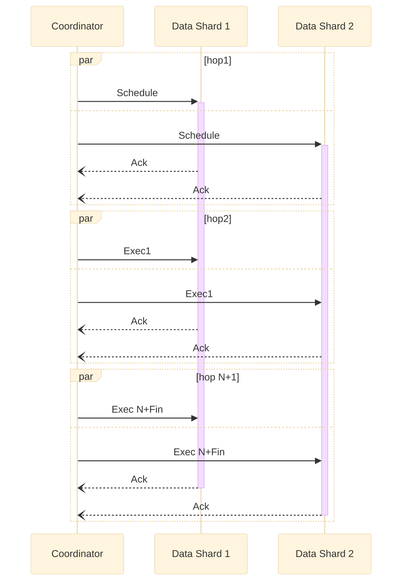

# 事务的生命周期

本文档描述了 Dragonfly 事务如何为其 **多键（multi-key）** 和 **多命令（multi-command）** 操作提供原子性和可序列化性。

## 定义

### 可串行化

可串行性是数据库事务的隔离级别。可串行性描述了多个事务，其中一个事务通常由对多个对象的多个操作组成。

数据库可以并行执行事务（以及并行操作）。可串行性保证结果相同，就好像事务是一笔一笔地执行的。即表现得像按串行顺序执行。

可序列化性并不能保证生成的序列顺序符合**新近原则**。即串行顺序可以与事务实际执行的顺序不同。例如，Tx1 早于 Tx2 开始，但结果就像 Tx2 在 Tx1 之前执行一样。也就是说，为了满足相同的Serializability，可以有不止一种可能的执行调度。

### 严格的可串行性

严格的可串行性意味着操作似乎是按某种顺序发生的，与这些操作的实时顺序一致；例如，如果操作 A 在操作 B 开始之前完成，则按序列化顺序，A 应出现在 B 之前。

严格的可串行性意味着原子性，事务的子操作不会与其他事务的子操作交错。根据定义，它还意味着可序列化（以某种顺序出现......）。

请注意，Dragonfly 中的简单 **单键操作** 已经是严格可序列化的，因为在无共享架构中，每个分片线程都按顺序对其 key 执行操作。当我们需要为生成多个 key 的操作提供严格的可串行性（也称为可串行性和线性化）时，复杂性就会增加。

## 事务的高级概述
Dragonfly 中的事务由称为协调层的抽象实体编排。实际上，客户端连接实例，从协调器的获得自己扮演的角色：每次驱动 redis 或 memcached 命令完成时，它都会协调事务。Dragonfly 交易背后的算法基于 [VLL paper](https://www.cs.umd.edu/~abadi/papers/vldbj-vll.pdf) 论文。

协调器中的每个步骤都是按顺序完成的。因此，使用序列图更容易描述流程。下面是由多个执行步骤组成的通用事务的序列图。在此图中，它执行的操作涉及两个不同分片中的键： `Shard1` and `Shard2`.



Dragonfly 的无共享架构不允许直接从协调器纤程访问每个分片数据。相反，协调器向分片发送消息并指示它们在每个步骤中做什么。每次协调器发送消息时，它都会阻塞，直到得到答复。我们将这种交互称为 *消息跳跃（message hop）* 或者简称 *跳跃（hop）* in short.

该流程由两个不同的阶段组成： *调度* 事务和 *执行* 事务。 执行阶段可能包含一跳或多跳，具体取决于我们建模的操作复杂性。

*请注意，只有协调器纤程被阻塞。它的线程仍然可以执行其他纤程进行操作 - 例如处理其他连接上的请求或处理它拥有的分片的操作。这是采用纤程的优点 - 它们允许我们将执行上下文与操作系统线程分开。*

## 调度事务

事务以调度跳跃（hop）启动，在此期间协调器将分片处理的 key 发送到每个分片。协调器异步向多个分片发送消息，但它会等待所有分片确认调度成功，然后再继续下一步。

当数据分片处理调度消息时，它会将事务添加到其本地事务队列（tx-queue）中。为了提供可串行性，即确保所有分片以相同的顺序对其计划的事务进行排序，Dragonfly 维护一个全局序列计数器，用于归纳其所有事务的总顺序。

该全局计数器由所有协调器实体共享，并由原子整数表示。 *这个计数器可能是争论的一个根源——毕竟它打破了无共享模型。然而，在实践中，我们没有观察到由于我们添加的其他优化而对 Dragonfly 性能产生重大影响。这些将在下面的 [优化](#optimizations) 部分详细介绍。

每个分片中的 tx-queue 中的事务按其序列计数器排列。

如下面的代码片段所示，分片线程可能会以不同的顺序接收交易，因此可以在具有较大 id 的交易之后将具有较小 id 的交易添加到 tx-queue 中。如果调度算法在数据分片上运行，无法对最后添加的事务进行重新排序，则调度请求失败。在这种情况下，协调器通过从分片中删除 tx 来恢复调度操作，并通过分配新的序列号再次重试整个跳跃（hop）。实际上，调度尝试的失败率很低，并且重试很少（受到 key 争用的影响）。请注意，当两个协调器尝试同时安排多分片事务时，会发生不一致的重新排序：

```
C1: enqueue msg to Shard1 to schedule T1
C2: enqueue msg to Shard1 to schedule T2  # enqueued earlier than C1

C1: enqueue msg to Shard2 to schedule T1
C2: enqueue msg to Shard2 to schedule T2 # enqueued later than C1

shard1: pull T2, add it to TxQueue, pull T1, add it to TxQueue
shard2: pull T1, add it to TxQueue, pull T2, add it to TxQueue

TxQueue1: T2, T1  # wrong order
TxQueue2: T1, T2
```


一旦交易被添加到 tx-queue，分片也会使用 *意向锁（intent lock）* 标记  tx-keys 。 这些锁不会阻止底层操作的流程，而只是表达访问或修改 key 的意图。 实际上，它们由 map 表示：`lock:str->counter`。 如果`lock[key] == 2` 这意味着 tx 队列有 2 个待处理的事务计划修改 `key`。 这些意向锁用于下面详细介绍的优化，并且不需要实现 VLL 算法的简单版本。

一旦调度跳数（hop）收敛，就意味着事务进入执行阶段，在此阶段它永远不会回滚或重试。一旦被调度，VLL 就会保证后续执行操作的进度，同时提供严格的可串行性保证。

值得注意的是，被调度的事务并不对其 key 拥有排他性。可能还有其他事务仍然会改变它所拥有的 key —— 这些事务是较早安排的并且尚未完成运行，甚至还没有开始运行。


## 执行事务

一旦事务被调度，协调器就开始发送执行消息。我们将每个命令分解为一个或多个微操作（micro-op），每个操作对应于一个消息跳跃（hop）。

例如， "MSET"  对应于具有相同语义的单个微操作（micro-op） "mset" ，但在所有涉及的分片上并行运行。

然而，"RENAME" 需要两个微操作（micro-op）：从两个 key 获取数据，然后第二跳 - 删除/写入key（取决于 key 是源还是目的地）。

一旦协调器向所有分片发送微操作请求，它就会等待答复。只有当所有分片都执行了微操作（micro-op）并返回结果时，协调器才被解除阻塞，并且可以继续下一跳。协调器可以处理来自前一跳的中间响应，以便定义下一个执行请求。

当协调器向数据分片发送执行请求时，它还会指定此执行是否是该命令的最后一跳。这是必要的，以便分片在运行最后一个执行请求时可以执行清理操作：解锁密钥并从 tx 队列中删除事务。

分片始终在事务队列的头部执行事务。当执行该事务的最后一个执行跳跃时，该事务将从队列中删除，并且可以执行下一个事务。通过这种方式，我们维护了事务调度顺序指定的排序保证，并维护了跨多个分片的操作的可串行性。

## 多操作事务（Redis 事务）

Redis 事务 (MULTI/EXEC sequences) 和 Lua 脚本生成的命令被建模为 Dragonfly 事务中的连续命令。为了避免术语产生歧义，我们将 Redis 事务称为 Dragonfly 中的多事务（ multi-transaction）。

事务框架的多功能特性允许运行连续的命令，而无需为每个命令重新安排事务，就好像它们是单个事务的一部分一样。此功能对于命令本身是透明的，因此无需更改即可在多事务（multi-transaction）中使用它们。

存在三种称为 “多模式（multi modes）” 的模式，可以执行多个事务，每种模式都有自己的优点和缺点。

__1. 全局模式（Global mode）__

该事务相当于多跳的全局事务。它是全局调度的，并且命令作为一系列连续的跳跃来执行。全局命令（如 MOVE）和访问 Lua 脚本中未声明的键需要此模式。否则，应该避免它，因为它会阻塞 Dragonfly 并发运行，从而大大降低吞吐量。

__2. 提前锁定模式（Lock ahead mode）__

该事务相当于具有多跳的常规事务。它被调度在事务块或 Lua 脚本中的命令使用的所有 key 上，并且命令作为一系列连续的跳跃执行。

__3. 非原子模式（Non atomic mode）__

所有命令都作为单独的事务执行，使得多事务（multi-transaction）不是原子的。它极大地提高了竞争访问操作 Key 的吞吐量，因为仅针对单个命令获取锁。此模式对于没有原子性要求的 Lua 脚本很有用。 

## 多操作（Multi-op）命令压缩

在 Dragonfly 上执行一系列连续命令有两个基本问题：
* 每个命令调用都需要开销极大的跳跃（hop）
* 顺序执行命令没有使用我们的多线程架构

幸运的是，我们可以对命令序列进行一项重要观察。给定一系列命令， _其中每个命令仅需要访问单个分片_ ，只要它们是一个原子事务的一部分：
* 每个命令只需要保留其相对于访问同一分片的其他命令的顺序
* 访问不同分片的命令可以并行运行

命令压缩背后的基本思想是识别连续的一系列单分片命令并按分片将它们分开，同时保持它们在每个分片内的相对顺序。一旦命令被分离，我们就可以在所有相关分片上执行单跳（hop）。在每个分片中，跳跃回调将仅逐一执行分配给其各自分片的命令。由于所有命令都已放置在其相关线程上，因此不需要进一步的进行跳跃（hop），并且所有命令回调都会内联执行。

回顾我们最初的问题，命令压缩：
* 允许仅一跳执行多个命令
* 允许并行执行命令

## 优化
无序交易 - 待开发

## 阻塞命令 (BLPOP)

Redis 拥有丰富的 api，包含大约 200 个命令。这些命令很少提供阻塞语义，允许使用 Redis 作为发布者（publisher）/（subscriber ）订阅者代理。

Redis（作为单个节点运行时）是著名的单线程，并且其所有操作都是严格可序列化的。为了构建具有与 Redis 等效语义的多线程内存存储，我们必须设计一种算法，该算法可以并行化潜在的阻塞操作，同时仍然提供严格的可串行性保证。本节主要关注如何解决 BLPOP (BRPOP) 命令的这一挑战，因为它涉及协调多个键并且被认为是更复杂的情况。其他阻塞命令可以从相同的原理中受益。


### BLPOP 规范

BLPOP key1 key2 key3 0

*BLPOP 是阻塞列表（list） POP原语。它是 LPOP 的阻塞版本，因为当没有可以从任何给定列表中弹出的元素时，它会阻塞客户端连接。从第一个非空列表的头部弹出一个元素，并按照给出的顺序检查给定的键。*

### BLPOP 的非阻塞行为
当调用 BLPOP 时，如果至少一个指定的 key 包含非空列表，则会从列表的头部弹出一个元素，并将其与从中弹出的 key 一起返回给调用者。key 按照给出的顺序进行检查。假设 key1 不存在，并且 key2 和 key3 包含非空列表。因此，在上面的示例中，BLPOP 返回 list2 中的元素。

### 阻塞行为
如果指定的 key 都不存在，则 BLPOP 会阻止连接，直到另一个客户端对其中一个 key 执行 LPUSH 或 RPUSH 操作。一旦列表之一出现新数据，客户端就会返回unlock该数据的 key 名称以及弹出的 value。

### 排序语义
如果客户端尝试等待多个 key，但至少有一个 key 包含元素，则返回的 key/元素 对是从左到右第一个包含一个或多个元素的 key。在这种情况下，客户端不会被阻止。例如，BLPOP key1 key2 key3 key4 0，假设 key2 和 key4 都非空，将始终返回 key2 中的元素。

如果多个客户端因同一 key 而被阻塞，则第一个得到服务响应的客户端是等待时间较长的客户端（第一个因该 key 而被阻塞的客户端）。一旦客户端被解除阻塞，它就不会保留任何优先级，当它在下一次调用 BLPOP 时再次阻塞时，它将根据已经在等待相同 key 的客户端的队列顺序来服务。

当客户端同时在多个 key 上阻塞，并且多个 key 中的元素同时变得可用（由于事务）时，客户端将通过左侧第一个通过 push 操作接收数据的 key 解除阻塞（假设它有足够的元素来响应我们的客户端，因为可能还有更早的客户端也在等待这个 key）。

### BLPOP 和事务
如果通过事务或 LPUSH 命令的可变参数推送多个元素，则在该事务或命令完全完成后 BLPOP 被唤醒。具体来说，当客户端执行 `LPUSH listkey a b c`， 然后 `BLPOP listkey 0` 会弹出 `c`， 因为 `lpush` 先推入 `a`然后 `b` 再被push进来，然后 `c` 是左边的第一个。

如果客户端执行的事务首先 push 进列表，然后自动从列表中弹出， 则另一个被阻止的 `BLPOP` 客户端将不会弹出任何东西。 因为它会等待事务完成。当 BLPOP 本身在事务中运行时，它的阻塞行为将被禁用，并且如果没有要弹出的元素，它会返回“超时”响应。

### 在 Dragonfly 中实现 BLPOP 的复杂性
BLPOP 的排序语义认可 底层操作的总顺序。必须同时“观察”多个 key，以便按照从左到右的顺序确定哪一个非空。如果没有包含项目的key，BLPOP 会阻塞、等待并“观察”哪个 key 首先被填充。

对于单线程 Redis，顺序是通过遵循主执行线程内操作的自然顺序就可以确定的。然而，对于多线程、无共享执行，不存在全序或全局同步时间线的概念。对于非阻塞场景，“观察” key的动作是原子的，因为我们在 Dragonfly 中执行命令时锁定键。

然而，对于 BLPOP 的阻塞场景，我们没有内置机制来确定哪个键较早被填充 - 因为，如上所述，多个分片不存在总顺序的概念。

### 值得思考的有趣例子

**例子1:**
```
client1: blpop X, Y  // blocks
client2: lpush X A
client3: exist X Y
```

Client3 应始终返回 0。

**例子2:**

```
client1: BLPOP X Y Z
client2: RPUSH X A
client3: RPUSH X B;  RPUSH Y B
```

**例子3:**

```
client1: BLPOP X Y Z
client2: RPUSH Z C
client3: RPUSH X A
client4: RPUSH X B; RPUSH Y B
```

### BLPOP 漫谈
唤醒一个被阻塞大的 `BLPOP` 有两种情况：

a. 使用 lpush/rpush/rename 命令。
b. 通过多事务 multi-transaction.

`(a)` 实际上很容易推理，因为这些命令对单个键进行操作，并且单个键操作在无共享架构中是严格可序列化的。

`(b)` 这块我们需要考虑这样的情况：我们有 "BLPOP X Y 0" ，然后多事务（multi-transaction）通过多个 “LPUSH” 命令填充 `y` and `x` 两者。 幸运的是，Dragonfly 中的多事务在其所有分片之间引入了全局屏障，并且只要它未完成，它就不允许任何其他事务运行。因此，在多事务完成其运行之前，阻塞的“blpop”不会被唤醒。到那时，key 的状态将被明确定义，并且 “blpop” 将能够选择要弹出的第一个非空键。

## 背景阅读：

### 严格的可串行性
这是一个a [非常棒的图表](https://jepsen.io/consistency)，显示了各种一致性模型如何相互关联。

单节点 Redis 是严格可序列化的，因为它的所有操作都是在单个线程中顺序且原子地执行的。

更正式的说： 遵循这边文章所定义的 https://jepsen.io/consistency/models/strict-serializable - 取决于Redis的单线程设计，其事务按照全局顺序执行，与主线程时钟一致，因此它是严格可序列化的。

可串行性是一个全局属性，给定事务日志，事务有一个一致的顺序（日志顺序不相关）。

可序列化但不可线性化事务的示例： https://gist.github.com/pbailis/8279494

更多的阅读材料：
* [Fauna Serializability vs Linearizability](https://fauna.com/blog/serializability-vs-strict-serializability-the-dirty-secret-of-database-isolation-levels)
* [Jepsen consistency diagrams](https://jepsen.io/consistency)
* [Strict Serializability definition](https://jepsen.io/consistency/models/strict-serializable)
* [Example of serializable but not linearizable schedule](https://gist.github.com/pbailis/8279494)
* [Atomic clocks and distributed databases](https://www.cockroachlabs.com/blog/living-without-atomic-clocks/)
* [Another cockroach article about consistency](https://www.cockroachlabs.com/blog/consistency-model/)
* [Abadi blog](http://dbmsmusings.blogspot.com/)
* [Peter Beilis blog](http://www.bailis.org/blog) （两人都写了很多关于该主题的材料）
