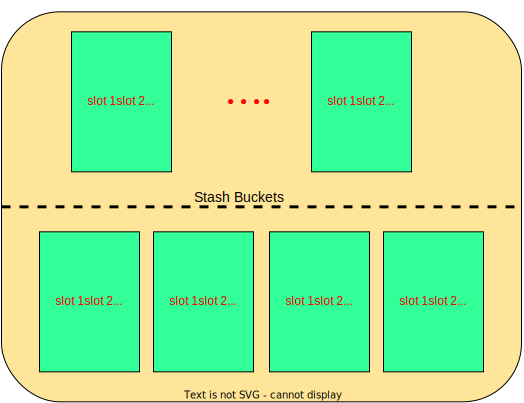
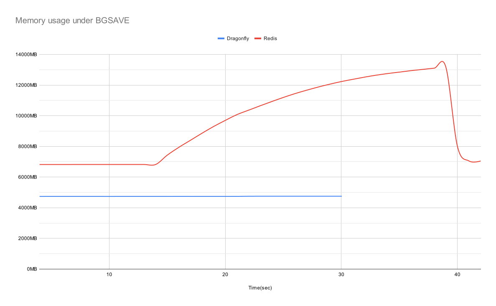

# Dragonfly中的Dashtable

Dashtable 是 Dragonfly 中非常重要的数据结构。本文档解释了它是如何适配在引擎内的。

每个Selectable数据库都包含一个主 Dashtable，它包含所有的数据条目。 另一个 Dashtable 实例包含一个可选的到期时间信息， 用于过期那些具有 TTL 的 key。 Dashtable 相当于 Redis 的字典，但是它具有一些很棒的特性，使 Dragonfly 内存效率在任何情况下都高效。


## Redis字典

*“计算机科学领域的任何问题都可以通过增加一个间接的中间层来解决”*

本节简要回顾一下 Redis 字典（RD）的实现方式。
我们很羞愧的从 [这篇博文](https://codeburst.io/a-closer-look-at-redis-dictionary-implementation-internals-3fd815aae535)中“借用”了一张图表， 所以你想深入了解，你可以阅读原始文章。

每个 `RD` 实际上都是两个哈希表 (参见下图中的 `ht` 字段 )。 第二个实例用于增量调整字典的大小。
每一个 `dictht` 哈希表被实现为 [链接法的经典哈希表](https://en.wikipedia.org/wiki/Hash_table#Separate_chaining)。 `dictEntry` 是包装表内每个 Key/Value 对的链接列表条目。 每个 dictEntry 有3个指针，占用24字节的空间。`dictht` 的 bucket 数组以 2 的幂调整大小，因此通常其利用率在 [50, 100] 范围内。


<br>

让我们估算一下 `dictht` 表在RD内的开销。

*案例 1*: 在负载为100%的时候有 `N` 个item ， 换句话说，bucket 总数等于item总数。每个 bucket 保存一个指向 dictEntry 的指针，即它有 8 个字节。 我们总共需要: $8N + 24N = 32N$ 字节每条记录。 <br>
*案例 2*: 在负载为75%的时候有 `N` 个item， 换句话说， bucket 的数量是item数量的1.33倍。 我们总共需要: $N \*1.33\*8 + 24N \approx 34N$ 字节每条记录。 <br>
*案例 3*: 在负载为50%的时候有 `N` 个item， 即在表增长之后。bucket 的数量是 item 的两倍， 因此我们需要: $N\*2\*8 + 24N = 40N$ 字节每条记录。

在最好的情况下，我们至少需要 16 字节去存储表里的 key/value 键值对， 因此每个 item 的开销 `dictht` 平均约为 16-24 字节。

现在让我们把增量增长考虑进去。 当 `ht[0]` 满了 (即 RD 需要迁移数据到更大的表)的时候， 它将实例化第二个临时实例， `ht[1]` 它将容纳额外的 2*N个 bucket。 两个实例将并行存在，直到所有数据都被迁移到 `ht[1]`，然后 `ht[0]` bucket数组将被删除。 所有这些复杂性都通过精心设计的 RD API 对用户隐藏起来。 让我们结合案例 3 和案例 1 来分析此时的内存峰值： `ht[0]` 持有 `N` 个item并且它被充分利用。 `ht[1]` 被分配了`2N`个 bucket 。总体而言，峰值期间所需的内存为 $32N + 16N=48N$字节

总而言之， RD 需要 **16-32字节的开销**。

## Dash table

[Dashtable](https://arxiv.org/abs/2003.07302) 是1979年一种被称为 [extendible hashing](https://en.wikipedia.org/wiki/Extendible_hashing) 可扩展哈希的演变。

与经典的哈希表类似，Dashtable (DT) 也在前面保存了一个指针数组。 然而， 与经典表不同， 它指向 `segments` 而不指向item的链接列表。 每个 `segment` 事实上，每个都是一个大小恒定的迷你哈希表。 前面指向 segments 的数组称为 `directory`。与经典表相似， 当一个 item 被插入 DT 中时， 它首先通过 item 的 hash 值确定 segment。 该 segment 被实现为一个具有开放寻址散列方案的 hashtable，并且正如我所说的， - 大小恒定。 一旦确定了 segment ，该 item 就会被插入到其 bucket 中。 如果成功插入一个 item ， 我们就完成了，否则，该 segment 已满并且需要分裂。 DT 会把一个满了的 segment 内容拆分成两个 segment， 并将新增的segment添加到 directory 中。 然后它会尝试再次插入该 item 。总而言之，经典的链式哈希表（chaining hash-table） 是建立在动态链接数组之上的，而 dashtable 更像是恒定大小的平面哈希表（flat hash-table）的动态数组。


在上图中，您可以看到 dashtable 长什么样子。 每个 segment 都由 `K` 个bucket组成。 例如，在我们的实现中，一个 dashtable 的每个 segment 有 60 个 bucket 组成（这是一个可以配置的编译时参数）。

### Segment放大

下面您可以看到一个表述 segment 的图。他由常规bucket和存储bucket组成。 每个 bucket 包含 `k` 个 slot ，每个 slot 可以持有一个 key-value 记录。



在我们的实现中，每个 segment（段）包含56个常规 bucket ，4个存储 bucket ，每个 bucket 包含 14 个 slot（槽）。总体来说， 每个 dashtable 的 segment 可以容纳 840 条记录。当一个 item 被插入到 segment 中时， DT首先根据 item 的 hash 值确定它的 home bucket。home bucket 是 segment 中56个常规 bucket 之一。 每个 bucket 有 14 个可用的 slot，并且 item 可以驻留在任何空闲的 slot 中。如果 home bucket 满了，则DT会尝试插入到右侧的常规 bucket 中。 如果那个 bucket 也满了，它会尝试插入到4个存储 bucket 中的其中一个中去。
这些4个存储桶被故意放在一边，就是为了收集常规桶中存储不下溢出的数据。 当插入失败时，segment 是满的，即 home bucket 和相邻的 bucket 还有所有的4个存储 buckets 都已经满了。 这里请注意一下，segment 不必满容量运行，可能其他 bucket还没有满，但是不幸的是，item 只能插入则6个 buckets ，因此必须拆分 segment 内容，如果发生拆分事件， DT会创建一个新的 segment，将它添加到目录中，然后旧 segment 中的 item 会有部分被转移到新的 segment 中，并且重新均衡旧 segment。在分割事件中仅涉及两个 segment。

现在我们可以解释为什么看似相似的数据结构在内存和 CPU 方面比经典哈希表具有优势。

 1. 内存： 我们需要 dashtable 目录中的 `~N/840` 个 entry 或者 `8N/840` 字节来平均容纳 N 个 item。基本上，目录的开销在DT中都消失了。 假设对于1M item 我们需要约 ~1200个 segment 或者 9600 字节作为主 array(数组)。这与RD形成鲜明对比，在 RD 中我们需要消耗 `8N` 个 bucket array 开销 - 无论如何。对于1M的 item，很显然是 8MB。此外， dash segment 使用带有探测的开放寻址冲突方案，这意味着它不需要任何像 `dictEntry` 的东西。Dashtable 使用了很多技巧来缩小自己的元数据，在我们的实现中，与 RD (dictEntry.next) 中的 64 bits相比，每个entry的平均长度 `tax` 不足20 bits。除此之外， DT 增量调整大小不会分配一个更大的表 - 而是在每个拆分事件中增加一个 segment 。 假设 key/pair entry 为两个8字节的指针（如RD中所示），而 DT 在 100% 利用率的时候需要 $16N + (8N/840) + 2.5N + O(1) \approx 19N$ 字节数。这个数字十分接近 16 字节的最佳值。
 在不太可能的情况下，当所有的 segment 的大小都翻倍的情况下，即DT在50%利用率的时候，我们每个 item 可能需要 $38N$ 字节。实际上，每个 segment 独立于其他 segment 增长，所以该 table 具有每个项目 22-32 字节或者 **6-16 字节的开销**。

 2. 速度： RD 需要在每次插入的时候分配一个 dictEntry，并在每次删除的时候释放。除此之外，RD 使用链接，这在现代硬件上对缓存不是很友好。 然而， DT 的字典大小相对较小：
 在上面的示例中，所有 9 K都可以在 L1 缓存中重新调整大小。 然而一旦确定了 segment，其余的插入就会非常快，并且主要在1-3个内存高速缓存线上进行操作。
 最后，在调整大小的区间，RD需要分配一个大小为 `2N` 的 bucket 数组。这可能非常耗时 - 想象一下分配 100M 个存储 bucket。另一方面，DT需要为每一个新 segment 分配恒定的大小。DT 更快一些，更重要的是 - 它的增量能力更好。它消除了延迟峰值并减少了上述操作的尾部延迟。

请注意，尽管 Dashtable 的效率很高，但它无法大幅减少总体内存使用量。其主要目标是减少字典管理方面的浪费。

话虽如此，通过减少元数据浪费，我们可以将 Dragonfly 特定的属性插入表的元数据中，以实现其他智能算法。例如 无fork 的快找存储。[从这里可以看到](#forkless-save) Dragonfly的一些破坏品质。

## 基准测试

除了 DT 之外，Dragonfly 还有许多其他节省内存的改进。我无法在这里一一介绍它们。以下结果显示截至 2022 年 5 月的最终结果。

### 单线程填充数据

为了比较 RD 与 DT，我经常使用内部调试命令 “debug populate”，该命令可以快速用数据填充两个数据存储。与 memtier_benchmark 相比，它只是节省时间并提供更一致的结果。它还显示了每个字典填充的原始速度，无需网络、解析等中间媒介因素。我故意用小数据填充数据集，以显示两种数据结构之间元数据的开销有何不同。

我在我的家用机器 “AMD Ryzen 5 3400G with 8 cores” 上的两个引擎上运行 “debug populate 20000000”(20M)。

|             | Dragonfly | Redis 6 |
|-------------|-----------|---------|
| Time        |   10.8s   |  16.0s  |
| Memory used |    1GB    |  1.73G  |

当查看Redis6 "info memory" 统计信息时，你可以看到 `used_memory_overhead` 字段值为 `1.0GB` 。这意味着在分配的 1.73GB 字节中，有 1.0GB 是用于元数据的，对于小数据量用例，Redis 中的元数据成本要大于数据本身。

### 多线程填充数据

现在我在8核服务器上运行Dragonfly。当然，Redis也有同样的结果。

|             | Dragonfly | Redis 6 |
|-------------|-----------|---------|
| Time        |   2.43s   |  16.0s  |
| Memory used |    896MB  |  1.73G  |

由于采用无共享架构，Dragonfly每个线程都维护一个包含自己数据切片的 Dashtable。 每个线程填充自己拥有的20M范围的 1/8 - 而且速度更快，几乎快8倍。 你可以看到总使用量甚至更小，因为现在我们在每个线程中维护更小的表 （但情况并非如此 - 与单线程场景相比，我们可能会得到稍微更差一点的内存利用率， 这取决于我们与hash表相比时的利用率）。

### 无fork的快照保存

此示例显示了与 Redis 相比，Dragonfly 在负载下的 BGSAVE 期间使用了多少内存。顺便说一句，Dragonfly 中的 BGSAVE 和 SAVE 是相同的过程，因为它是使用完全异步算法实现的，可维护时间点快照保证。

该测试包括 3 个步骤：

1. 在两台服务器上执行 `debug populate 5000000 key 1024` 命令以快速填充大约 5GB 数据。
2. 运行 `memtier_benchmark --ratio 1:0 -n 600000 --threads=2 -c 20 --distinct-client-seed  --key-prefix="key:"  --hide-histogram  --key-maximum=5000000 -d 1024` 命令以发送持续更新的流量。这个流量不应该显著影响两台服务器的内存使用情况。
3. 最后，在两台服务器上同时运行 `bgsave` ，同时观测它们的内存变化。

从技术上讲，在 BGSAVE 期间测量 Redis 的精确内存使用情况非常困难， 因为它创建了一个部分共享其父内存的子进程。 我们闲着 `cgroupsv2` 作为测量内存的工具。 我们将每台服务器放到一个单独的 cgroup 中， 并对每个 cgroup 的 `memory.current` 属性进行采样。由于包含fork的Redis进程继承了父进程的 cgroup，因此我们可以准确估算出它们的总内存使用量。 虽然Dragonfly不需要这个，但我们用了相当的方法来保持一致性。



正如您在图表中看到的，即使在 BGSAVE 启动之前，Redis也使用了50% 的内存。大约14秒左右的位置，BGSAVE 在两台服务器上启动。从视觉上看，您在 Dragonfly 图上几乎看不到有此事件，但在 Redis 图上看得很清楚。Dragonfly 只花了几秒钟就完成了快照（同样，无法看到），大约第 20秒的时候， Dragonfly 已经完成 BGSAVE 了。您可以在第39秒看到一个明显的断崖式曲线，Redis 完成其快照，在峰值时内存使用量几乎增加了3倍。

### 在写入期间 item 过期

高效的过期对于很多场景来说非常重要。例如，[Pelikan paper'21](https://twitter.github.io/pelikan/2021/segcache.html)。 Twitter团队表示，通过采用更好的过期方法，他们的内存占用量可以潇洒哦多达 60%，上述帖子的作者在下表中展示了过期方法的优缺点：


他们认为，主动过期对于及时删除过期项目非常重要。Dragonfly 采用自己的智能垃圾收集程序。通过利用DashTable分隔结构，它实际上可以采用非常高效的被动过期算法，且CPU开销较低。 我们的被动程序与后台主动逐步扫描表格相得益彰。

过程如下：
一个 dashtable 的 segment 在插入过程中变满并且需要拆分时候，dashtable就会增长。这是执行垃圾回收的一个方便点，但是仅限于那个 segment。我们扫描它的 bucket中是否有过期的 item。如果我们删除其中一些，我们可能会完全避免增加表！ 在潜在拆分前扫描 segment 的成本不在是拆分本身，因此可以估计为 `O(1)`。

我们使用 `memtier_benchmark` 实验来展示 Dragonfly 与 Redis 的过期效率。我们在本地运行以下命令：
```bash
memtier_benchmark --ratio 1:0 -n 600000 --threads=2 -c 20 --distinct-client-seed \
   --key-prefix="key:"  --hide-histogram --expiry-range=30-30 --key-maximum=100000000 -d 256
```

我们加载更大的值 （256 bytes）以减少 Dragonfly 元数据节省的影响。

|                      | Dragonfly | Redis 6 |
|----------------------|-----------|---------|
| Memory peak usage    | 1.45GB    |  1.95GB |
| Avg SET qps          | 131K      | 100K    |

请注意，Redis 的 qps 可能会降低 30%。 这意味着 Dragonfly 和 Redis 最佳的运行set效率是不同的 - 前者需要在任何时间点至少持有 `20s*131k` 个item。而后者只需要保持 `20s*100K` 个 item。
所以对于 `30%` 更大的set数量，Dragonfly 在峰值的时候仅仅需要`25%`更少的内存利用率。

<em>*请忽略本次测试中 Dragonfly 相对于 Redis 的性能优势 - 它没有任何意义。我在我的机器上本地运行它，它并不代表真正的吞吐量基准。 </em>

<br>

*本文档中的所有图表都是在[drawio app](https://app.diagrams.net/)中创建的*
