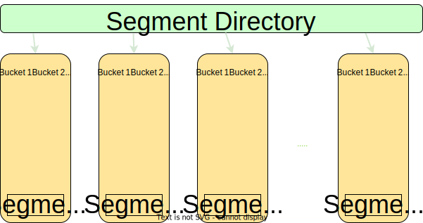

# Dragonfly中的Dashtable

Dashtable是Dragonfly中非常重要的数据结构。本文档解释了它是如何适配在引擎内的。

每个selectable数据库都包含一个主dashtable，它包含所有的数据条目. 另一个Dashtable实例包含一个可选的到期时间信息, 用于过期那些具有TTL的key. Dashtable 相当于Redis的字典，但是它具有一些很棒的特性，使 Dragonfly内存效率在任何情况下都高效.


## Redis字典

*“计算机科学领域的任何问题都可以通过增加一个间接的中间层来解决”*

本节简要回顾一下redis字典（RD）的实现方式.
我们很羞愧的从 [这篇博文](https://codeburst.io/a-closer-look-at-redis-dictionary-implementation-internals-3fd815aae535)中“借用”了一张图表, 所以你想深入了解，你可以阅读原始文章。

每个 `RD` 实际上都是两个哈希表 (参见下图中的`ht`字段 ). 第二个实例用于增量调整字典的大小。
每一个`dictht`哈希表被实现为 [链接法的经典哈希表](https://en.wikipedia.org/wiki/Hash_table#Separate_chaining). `dictEntry` 是包装表内每个Key/Value对的链接列表条目. 每个dictEntry有3个指针，占用24字节的空间。`dictht` 的bucket数组以 2 的幂调整大小，因此通常其利用率在 [50, 100] 范围内。


<br>

让我们估算一下 `dictht` 表在RD内的开销.

*案例 1*: 在负载为100%的时候有 `N` 个item , 换句话说,bucket总数等于item总数. 每个bucket保存一个指向 dictEntry 的指针，即它有 8 个字节。 我们总共需要: $8N + 24N = 32N$ 字节每条记录。 <br>
*案例 2*: 在负载为75%的时候有 `N` 个item, 换句话说, bucket的数量是item数量的1.33倍。 我们总共需要: $N\*1.33\*8 + 24N \approx 34N$ 字节每条记录。 <br>
*案例 3*: 在负载为50%的时候有 `N` 个item, 即在表增长之后。bucket的数量是items的两倍, 因此我们需要: $N\*2\*8 + 24N = 40N$ 字节每条记录.

在最好的情况下，我们至少需要16字节去存储表里的 key/value 键值对, 因此每个item的开销`dictht` 平均约为16-24字节.

现在让我们把增量增长考虑进去。 当 `ht[0]` 满了 (即 RD 需要迁移数据到更大的表)的时候, 它将实例化第二个临时实例， `ht[1]` 它将容纳额外的2*N个bucket. 两个实例将并行存在，直到所有数据都被迁移到 `ht[1]`，然后 `ht[0]` bucket数组将被删除。 所有这些复杂性都通过精心设计的 RD API 对用户隐藏起来。 让我们结合案例 3 和案例 1 来分析此时的内存峰值： `ht[0]` 持有 `N` 个item并且它被充分利用。 `ht[1]` 被分配了`2N`个bucket.总体而言，峰值期间所需的内存为 $32N + 16N=48N$字节

总而言之, RD 需要 **16-32字节的开销**.

## Dash table

[Dashtable](https://arxiv.org/abs/2003.07302) 是1979年一种被称为 [extendible hashing](https://en.wikipedia.org/wiki/Extendible_hashing)可扩展哈希的演变.

与经典的哈希表类似，dashtable (DT) 也在前面保存了一个指针数组。 然而， 与经典表不同， 它指向 `segments` 而不指向item的链接列表. 每个 `segment` 事实上，每个都是一个大小恒定的迷你哈希表。 前面指向segments的数组称为 `directory`。与经典表相似， 当一个item被插入DT中时， 它首先通过item的hash值确定segment。 该segment被实现为一个具有开放寻址散列方案的hashtable，并且正如我所说的， - 大小恒定. 一旦确定了segment，该item 就会被插入到其bucket中。 如果成功插入一个item， 我们就完成了，否则，该segment已满并且需要分裂。 DT 会把一个满了的segment内容拆分成两个segment, 并将新增的segment添加到directory中。 然后它会尝试再次插入该item。总而言之，经典的链式哈希表（chaining hash-table） 是建立在动态链接数组之上的，而dashtable 更像是恒定大小的平面哈希表（flat hash-table）的动态数组。



在上图中，您可以看到dashtable长什么样子。 每个segment都由 `K` 个bucket组成。 例如，在我们的实现中，一个dashtable的每个segment有60个bucket组成（这是一个可以配置的编译时参数）。

### Segment放大

Below you can see the diagram of a segment. It comprised of regular buckets and stash buckets. Each bucket has `k` slots and each slot can host a key-value record.


In our implementation, each segment has 56 regular buckets, 4 stash buckets and each bucket contains 14 slots. Overall, each dashtable segment has capacity to host 840 records. When an item is inserted into a segment, DT first determines its home bucket based on item's hash value. The home bucket is one of 56 regular buckets that reside in the table. Each bucket has 14 available slots and the item can reside in any free slot. If the home bucket is full,
then DT tries to insert to the regular bucket on the right. And if that bucket is also full,
it tries to insert into one of 4 stash buckets. These are kept deliberately aside to gather
spillovers from the regular buckets. The segment is "full" when the insertion fails, i.e. the home bucket and the neighbour bucket and all 4 stash buckets are full. Please note that segment is not necessary at full capacity, it can be that other buckets are not yet full, but unfortunately, that item can go only into these 6 buckets,
so the segment contents must be split. In case of split event, DT creates a new segment,
adds it to the directory and the items from the old segment partly moved to the new one,
 and partly rebalanced within the old one. Only two segments are touched during the split event.

Now we can explain why seemingly similar data-structure has an advantage over a classic hashtable
in terms of memory and cpu.

 1. Memory: we need `~N/840` entries or `8N/840` bytes in dashtable directory to host N items on average.
 Basically, the overhead of directory almost disappears in DT. Say for 1M items we will
 need ~1200 segments or 9600 bytes for the main array. That's in contrast to RD where
 we will need a solid `8N` bucket array overhead - no matter what.
 For 1M items, it will obviously be 8MB. In addition, dash segments use open addressing collision
 scheme with probing, that means that they do not need anything like `dictEntry`.
 Dashtable uses lots of tricks to make its own metadata small. In our implementation,
 the average `tax` per entry is short of 20 bits compared to 64 bits in RD (dictEntry.next).
 In addition, DT incremental resize does not allocate a bigger table - instead
 it adds a single segment per split event. Assuming that key/pair entry is two 8
 byte pointers like in RD, then DT requires $16N + (8N/840) + 2.5N + O(1) \approx 19N$
 bytes at 100% utilization. This number is very close to the optimum of 16 bytes.
 In unlikely case when all segments just doubled in size, i.e.
 DT is at 50% of utilization we may need $38N$ bytes per item.
 In practice, each segment grows independently from others,
 so the table has smooth memory usage of 22-32 bytes per item or **6-16 bytes overhead**.

 1. Speed: RD requires an allocation for dictEntry per insertion and deallocation per deletion. In addition, RD uses chaining, which is cache unfriendly on modern hardware. There is a consensus in engineering and research communities that classic chaining schemes are slower than open addressing alternatives.
 Having said that, DT also needs to go through a single level of indirection when
 fetching a segment pointer. However, DT's directory size is relatively small:
 in the example above, all 9K could resize in L1 cache. Once the segment is determined,
 the rest of the insertion, however, is very fast an mostly operates on 1-3 memory cache lines.
 Finally, during resizes, RD requires to allocate a bucket array of size `2N`.
 That could be time consuming - imagine an allocation of 100M buckets for example.
 DT on the other hand requires an allocation of constant size per new segment. DT is faster
 and what's more important - it's incremental ability is better. It eliminates latency spikes
 and reduces tail latency of the operations above.

Please note that with all efficiency of Dashtable, it can not decrease drastically the
overall memory usage. Its primary goal is to reduce waste around dictionary management.

Having said that, by reducing metadata waste we could insert dragonfly-specific attributes
into a table's metadata in order to implement other intelligent algorithms like forkless save. This is where some of the Dragonfly's disrupting qualities [can be seen](#forkless-save).

## Benchmarks

There are many other improvements in dragonfly that save memory besides DT. I will not be
able to cover them all here. The results below show the final result as of May 2022.

### Populate single-threaded

To compare RD vs DT I often use an internal debugging command "debug populate" that quickly fills both datastores with data. It just saves time and gives more consistent results compared to memtier_benchmark.
It also shows the raw speed at which each dictionary gets filled without intermediary factors like networking, parsing etc.
I deliberately fill datasets with a small data to show how overhead of metadata differs between two data structures.

I run "debug populate 20000000" (20M) on both engines on my home machine "AMD Ryzen 5 3400G with 8 cores".

|             | Dragonfly | Redis 6 |
|-------------|-----------|---------|
| Time        |   10.8s   |  16.0s  |
| Memory used |    1GB    |  1.73G  |

When looking at Redis6 "info memory" stats, you can see that `used_memory_overhead` field equals
to `1.0GB`. That means that out of 1.73GB bytes allocated, a whooping 1.0GB is used for
the metadata. For small data use-cases the cost of metadata in Redis is larger than the data itself.

### Populate multi-threaded

Now I run Dragonfly on all 8 cores. Redis has the same results, of course.

|             | Dragonfly | Redis 6 |
|-------------|-----------|---------|
| Time        |   2.43s   |  16.0s  |
| Memory used |    896MB  |  1.73G  |

Due to shared-nothing architecture, Dragonfly maintains a dashtable per thread with its own slice of data. Each thread fills 1/8th of 20M range it owns - and it much faster, almost 8 times faster. You can see that the total usage is even smaller, because now we maintain
smaller tables in each
thread (it's not always the case though - we could get slightly worse memory usage than with
single-threaded case, depends where we stand compared to hash table utilization).

### Forkless Save

This example shows how much memory Dragonfly uses during BGSAVE under load compared to Redis. Btw, BGSAVE and SAVE in Dragonfly is the same procedure because it's implemented using fully asynchronous algorithm that maintains point-in-time snapshot guarantees.

This test consists of 3 steps:

1. Execute `debug populate 5000000 key 1024` command on both servers to quickly fill them up
   with ~5GB of data.
2. Run `memtier_benchmark --ratio 1:0 -n 600000 --threads=2 -c 20 --distinct-client-seed  --key-prefix="key:"  --hide-histogram  --key-maximum=5000000 -d 1024` command in order to send constant update traffic. This traffic should not affect substantially the memory usage of both servers.
3. Finally, run `bgsave` on both servers while measuring their memory.

It's very hard, technically to measure exact memory usage of Redis during BGSAVE because it creates a child process that shares its parent memory in-part. We chose `cgroupsv2` as a tool to measure the memory. We put each server into a separate cgroup and we sampled `memory.current` attribute for each cgroup. Since a forked Redis process inherits the cgroup of the parent, we get an accurate estimation of their total memory usage. Although we did not need this for Dragonfly we applied the same approach for consistency.


As you can see on the graph, Redis uses 50% more memory even before BGSAVE starts. Around second 14, BGSAVE kicks off on both servers. Visually you can not see this event on Dragonfly graph, but it's seen very well on Redis graph. It took just few seconds for Dragonfly to finish its snapshot (again, not possible to see) and around second 20 Dragonfly is already behind BGSAVE. You can see a distinguishable cliff at second 39
where Redis finishes its snapshot, reaching almost x3 times more memory usage at peak.

### Expiry of items during writes

Efficient Expiry is very important for many scenarios. See, for example,
[Pelikan paper'21](https://twitter.github.io/pelikan/2021/segcache.html). Twitter team says
that their memory footprint could be reduced by as much as by 60% by employing better expiry methodology. The authors of the post above show pros and cons of expiration methods in the table below:


They argue that proactive expiration is very important for timely deletion of expired items.
Dragonfly, employs its own intelligent garbage collection procedure. By leveraging DashTable
compartmentalized structure it can actually employ a very efficient passive expiry algorithm with low CPU overhead. Our passive procedure is complimented with proactive gradual scanning of the table in background.

The procedure is a follows:
A dashtable grows when its segment becomes full during the insertion and needs to be split.
This is a convenient point to perform garbage collection, but only for that segment.
We scan its buckets for the expired items. If we delete some of them, we may avoid growing the table altogether! The cost of scanning the segment before potential split is no more the
split itself so can be estimated as `O(1)`.

We use `memtier_benchmark` for the experiment to demonstrate Dragonfly vs Redis expiry efficiency.
We run locally the following command:

```bash
memtier_benchmark --ratio 1:0 -n 600000 --threads=2 -c 20 --distinct-client-seed \
   --key-prefix="key:"  --hide-histogram --expiry-range=30-30 --key-maximum=100000000 -d 256
```

We load larger values (256 bytes) to reduce the impact of metadata savings
of Dragonfly.

|                      | Dragonfly | Redis 6 |
|----------------------|-----------|---------|
| Memory peak usage    | 1.45GB    |  1.95GB |
| Avg SET qps          | 131K      | 100K    |

Please note that Redis could sustain 30% less qps. That means that the optimal working sets for Dragonfly and Redis are different - the former needed to host at least `20s*131k` items
at any point of time and the latter only needed to keep `20s*100K` items.
So for `30%` bigger working set Dragonfly needed `25%` less memory at peak.

<em>*Please ignore the performance advantage of Dragonfly over Redis in this test - it has no meaning.
I run it locally on my machine and it does not represent a real throughput benchmark. </em>

<br>

*All diagrams in this doc are created in [drawio app](https://app.diagrams.net/).*
