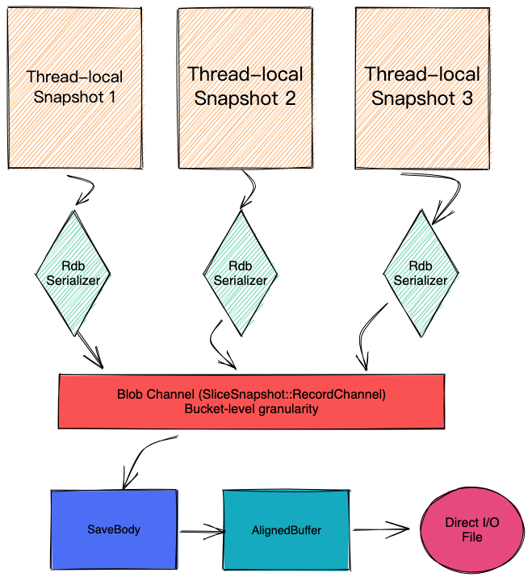

# Dragonfly 时间点快照设计
以下文档描述了 Dragonfly 的时间点、无fork快照过程的内部结构。有关设置 Dragonfly 备份设置的指南，请参阅[备份](https://www.dragonflydb.io/docs/managing-dragonfly/backups) 文档。

## 兼容 Redis 的 RDB
该快照被序列化为单个文件或网络socket。此配置用于创建与 Redis 兼容的备份快照。

该算法利用 Dragonfly 的无共享架构，并确保每个分片线程仅序列化自己的数据。以下是流程的高级描述。




1. 该类`RdbSave`实例化单个阻塞通道（红色）。它的目的是收集所有shard中的所有blobs。
2. 此外，它还在每个 DF 分片中创建线程本地快照实例。
TODO：将代码库中的它们重命名为另一个名称（SnapshotShard？），因为`snapshot`单词在这里会产生歧义。
3. 每个 SnapshotShard 都会实例化自己的 RdbSerializer，用于根据 Redis 格式规范将每个 K/V entry序列化为二进制表示形式。SnapshotShards 将同一 Dash 存储桶中的多个 Blob 组合成一个 Blob。它们总是以存储桶粒度发送 blob 数据，即它们从不将 blob 发送到仅部分覆盖存储桶的通道中。这是为了保证快照隔离所必需的。
4. RdbSerializer 用于`io::Sink`发出二进制数据。SnapshotShard 实例向其中传递一个 a，`StringFile`它只是一个包装`std::string`对象的基于内存的接收器。一旦`StringFile`实例变大，它就会被刷新到通道中（只要它遵循上述规则）。
5. RdbSave 还创建一个 Fiber (SaveBody)，从通道中拉出所有 blob。Blob 可能以未指定的顺序出现，但可以保证每个 Blob 都是自给自足的。
6. DF 使用直接 I/O 来提高 I/O 吞吐量，而这又需要正确对齐的内存缓冲区才能工作。不幸的是，来自 rdb 通道的 blob 具有不同的大小，并且它们不按操作系统页面粒度对齐。因此，DF将rdb通道中的所有数据通过AlignedBuffer转换传递。此类的目的是将传入数据复制到正确对齐的缓冲区中。一旦积累了足够的数据，它就会将其刷新到输出文件中。

总而言之，此配置使用单个接收器来创建代表整个数据库的一个文件或一个数据流。

## Dragonfly快照(TBD)
由于复制所需。需要创建多个文件，每个 SnapshotShard 一个文件。不需要中央水槽。每个 SnapshotShard 仍然使用 RdbSerializer 和 StringFile 来保证存储桶级别的粒度。如果我们想使用直接 I/O，我们仍然需要 AlignedBuffer。对于具有 N 个分片的 DF 进程，它将创建 N 个文件。可能需要额外的元数据文件来提供文件级一致性，但现在我们可以假设只创建了 N 个文件，因为我们的用例将是基于网络的复制。

它具体怎么使用呢？副本（Slave）将与master握手并了解其拥有多少个分片。然后它将打开`N`个sockets，每个sockets都会提取分片数据。首先，他们将提取快照数据，通过将entry分发到K个副本分片中。在重放所有快照数据后，它们将继续重放更改日志（stable state replication），这超出了本文档的讨论范围。

## 放松的 point-in-time (TBD)
当 DF 将其快照文件保存在磁盘上时，它通过对所有进程分片应用虚拟切口技术来维护快照隔离。快照可能需要一些时间，在此期间，DF可能会处理很多写入请求。这些突变不会成为快照的一部分，因为切口会捕获截从 **其开始 **时间点所有的数据。这非常适合备份。我将这种变化称为“保守快照”。

**但是，当我们执行复制快照时，我们希望生成一个快照，其中包含快照完成**时为止的所有数据。我把这种称为 *轻松快照*。宽松快照的原因是避免在快照创建期间保留所有变更的变更日志。

作为旁注 - 理论上，我们可以支持文件快照相同的（宽松的）语义，但没有必要，因为它可能会增加快照大小。

快照阶段（完全同步）可能会占用大量时间，从而给系统增加大量内存压力。在完全同步阶段将更改日志放在一边只会增加更多压力。我们通过将更改推送到复制socket而不将它们保存在一边来实现轻松的快照。当然，我们仍然需要时间点一致性，以便知道快照何时完成以及稳定状态复制何时开始。

## 保守而轻松的快照变化过程
两种算法都维护一个扫描过程（光纤），迭代地遍历主字典并序列化其数据。在开始该过程之前，SnapshotShard 会捕获其分片的更改epoch（该epoch随着每个写入请求而增加）。

```cpp
SnapshotShard.epoch = shard.epoch++;
```
为了简单起见，我们可以假设分片中的每个entry都维护自己的epoch计数器。通过捕获版本号，我们建立了一个切口：所有entry`version <= SnapshotShard.epoch` 尚未序列化，并且未被并发写入修改。

DashTable迭代算法保证了收敛性和覆盖率（“最多一次”），但不保证每个entry都被* ****恰好访问一次*** 。因此，我们使用entry版本有两个目的：1）避免多次序列化同一entry，2）正确序列化因并发写入而需要更改的entry。

序列化光纤：

```cpp
 for (entry : table) {

    if (entry.version <= cut.epoch) {

      entry.version = cut.epoch + 1;

      SendToSerializationSink(entry);

    }

 }
```
为了允许在快照阶段并发写入，我们设置了一个在表中的每个entry突变时触发的钩子：

OnWriteHook：

```cpp
....

if (entry.version <= cut.version) {

  SendToSerializationSink(entry);

}

...

entry = new_entry;

entry.version = shard.epoch++;  // guaranteed to become > cut.version
```
请注意，此挂钩通过在更改之前将entry的先前值推入接收器来维护保守变化的时间点语义。

然而，对于宽松的时间点，我们不必存储旧值。因此，我们可以执行以下操作：

OnWriteHook：

```cpp
if (entry.version <= cut.version) {

  SendToSerializationSink(new_entry);  // do not have to send the old value

} else {

  // Keep sending the changes.

  SendToSerializationSink(IncrementalDiff(entry, new_entry));

}


entry = new_entry;

entry.version = shard.epoch++;
```
更改数据与其余内容一起发送，并且需要扩展现有的rdb格式以支持差异操作，例如（hset、append等）。此变体的串行化光纤循环是相同的。


